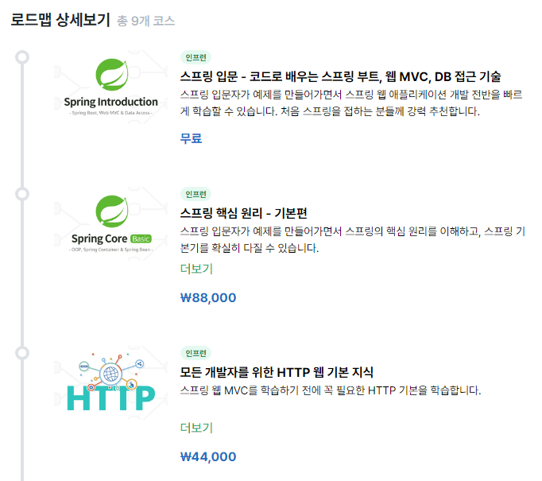

# 자바 스프링 프레임워크 스터디

## 주요 일정
- 우테코 서류 마감: 24.10.11 10am
- 우테코 프리코스: 24.10.15 ~ 24.11.11
- 관통 PJT: 24.11.14 ~ 24.11.21
- 우테코 최종코테: 24.12.14

## 진행 과정 + 제출 마감
- [ ] 24.10.02 ~ 24.10.08 : 스프링 입문(5h), 스프링 기본(6h, ~싱글톤 컨테이너)
- [ ] 24.10.09 ~ 24.10.15 : 스프링 기본(6h, ~다음으로), HTTP 웹 기본 지식(6h)
- [ ] 24.10.16 ~ 24.10.22 : 추후 공지
- [ ] 24.10.23 ~ 24.10.29 : -
- [ ] 24.10.30 ~ 24.11.05 : -
- [ ] 24.11.06 ~ 24.11.12 : -

## 목표
- 우테크 프리코스 성실 참여 후 합격
- java spring(jpa, mvc, db, ...) 학습

## 기간
6주

## 교재
- 스프링 입문 - 코드로 배우는 스프링 부트, 웹 MVC, DB 접근 기술
- 스프링 핵심 원리 - 기본편
- 모든 개발자를 위한 HTTP 웹 기본 지식

## 진행 방식
- 일일 과제
    - **인프런 강의 수강**
    - **학습 내용 정리(노션, 마크다운, 기술 블로그, ...)**
    - **정리한 내용 github 제출하기**
        - 하단 <깃허브 제출 방법> 참고
- 실습 과제
    - 프로그래머스 과제 테스트
 
## 학습 자료
| 자료 종류 | 제목                                              | 링크                                |
|-----------|--------------------------------------------------|-----------------------------------|
| 강의      | 스프링 입문 - 코드로 배우는 스프링 부트, 웹 MVC, DB 접근 기술                      | [링크](https://inf.run/hivx6)        |
| 강의      | 스프링 핵심 원리 - 기본편                      | [링크](https://inf.run/kCYMv) |
| 강의      | 모든 개발자를 위한 HTTP 웹 기본 지식                      | [링크](https://inf.run/8ZEU8) | 

## 깃허브 제출 방법

**fork 작업 흐름: https://suucong.tistory.com/22**

이번에는 clone 대신 fork 방식을 사용하겠습니다.  
꼭 fork를 해야 하는 상황은 아니지만, 미리 연습해보는 차원입니다.

**위 블로그 글을 꼼꼼하게 읽고 진행해 주세요.**  
모르거나 헷갈리거나 빨간 에러를 만났다면 주저 말고 말해주세요.

### 요약
1. 시작
   1. 중앙 원격 레포 -> fork -> 개인 원격 레포
   2. 개인 원격 레포 -> git clone -> 개인 로컬
2. 작업
   1. 개인 로컬에서 개인 브랜치 생성
       - 매번 새로운 브랜치를 생성하는 것이 안전함. 그러나 아직은 자율적으로 기존 브랜치 재활용 가능.
   2. 개인 브랜치에서 작업
   3. add -> commit 
3. 업로드
   1. 개인 로컬 -> git push origin {$작업 중인 브랜치명} -> 개인 원격 레포
   2. 첫 번째 PR 생성 후 merge (개인 로컬 작업 중인 브랜치 -> 개인 원격 main(혹은 본인이 설정한 default) 브랜치)
   3. 두 번째 PR 생성 후 merge (개인 원격 main 브랜치 -> 중앙 원격 dev 브랜치)
4. 재시작
   1. 개인 로컬 브랜치에서 git pull upstream dev (중앙 원격 dev 브랜치 -> 개인 로컬 브랜치)
   2. 2. 작업으로 돌아가서 반복 

 
 

### (참고용) 기존 git clone 작업 흐름
1. 시작
    1. if 처음 프로젝트를 생성한다면, `git clone {github repo 주소}`
    2. else if 이미 작업 중이던 프로젝트라면, `git pull origin dev`

2. `git branch {나의 브랜치명}` # 브랜치 생성

3. `git checkout {나의 브랜치명}` # 생성한 브랜치로 이동

4. 작업 후 저장

5. `git add .`

6. `git commit -m "feat : {문제 제목 혹은 번호}"` 

7. `git push origin {나의 브랜치명 == 현재 작업 중인 브랜치명}`
    - 문제 생기면 팀원들에게 바로 공유!

8. Pull Request

    1. github 돌아가서 해당 레포 상단에 Pull Request 생성 (초록색 `Compare & pull request` 버튼): 
        1. 타겟 브랜치 설정: `{dev}` <- `{나의 브랜치명 == 방금 작업 완료한 브랜치명}`
        2. 상세 커밋 내용 작성 (자동 완성 사용해도 무방)
        3. 초록색 `Create pull request` 버튼 클릭

    2. github에서 Merge
        1. if 문제 없으면, `Merge pull request` -> `Confirm merge`
        2. else if 문제 있으면, Conflict 해결 -> `Merge pull request` -> `Confirm merge`

    3. Pull Request가 자동으로 생기지 않으면?
        - [git clone으로 협업하기](https://velog.io/@rkio/git-clone%EC%9C%BC%EB%A1%9C-%ED%98%91%EC%97%85%EC%9D%84-%ED%95%B4%EB%B3%B4%EC%9E%90)

9. 새로운 작업 시작

    1. `{나의 브랜치명}`에서 `git pull origin dev` (1-2번을 수행한 것과 동일)

    2. 새로운 주차 디렉토리 하위에 본인 디렉토리 생성

    3. 다시 2번으로 돌아가서 반복...
