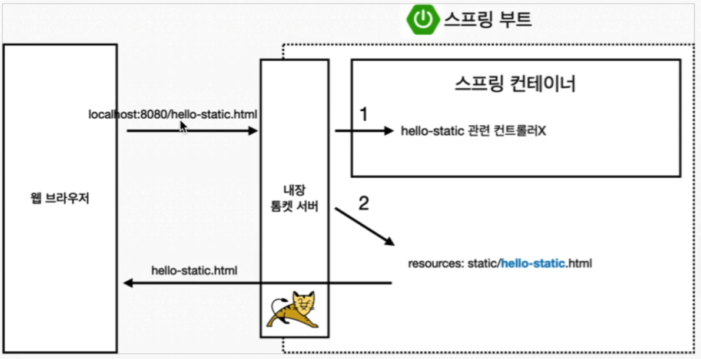

# 스프링 웹 개발 기초

# 정적 컨텐츠

정적 파일을 그대로 반환



# MVC와 템플릿 엔진

MVC 패턴을 기반으로 ****Controller가 요청을 처리하고 데이터를 준비한 후 View(템플릿 엔진)를 통해 동적으로 HTML을 생성하여 반환

```java
// HelloController.java

   @GetMapping("hello-mvc")
    public String helloMvc(@RequestParam(value="name", required=false) String name, Model model) {
        model.addAttribute("name", name);
        return "hello-template";
    }
```

```html
<!-- hello-template.html -->

<html xmlns:th="http://www.thymeleaf.org">
<body>
<p th:text="'hello '+ ${name}" >hello! empty</p>
</body>
</html>
```

## MVC(Model View Controller)


# API

```java
// HelloController.java

    @GetMapping("hello-api")
    @ResponseBody
    public Hello helloApi(@RequestParam("name") String name) {
        Hello hello = new Hello();
        hello.setName(name);
        return hello;
    }

    static class Hello {
        private String name;

        public void setName(String name) {
            this.name = name;
        }

        public String getName() {
            return name;
        }
    }
```

- `ctrl` + `shift` + `enter` : 코드 완성 단축키
- `alt` + `insert` : 코드 생성 단축키(예: getter, setter, constructor, … )


`@ResponseBody`

- HTTP의 BODY에 문자 내용을 직접 반환
- `viewResolver` 대신에 `HttpMessageConverter`가 동작
- 기본 문자처리: `StringHttpMessageConverter`
- 기본 객체처리: `MappingJackson2HttpMessageConverter`
- byte 처리 등등 기타 여러 `HttpMessageConverter`가 기본으로 등록되어 있음

⇒ 메서드가 반환하는 데이터를 `HttpMessageConverter`를 사용하여 JSON, XML 등의 형식으로 변환

- 메서드의 반환값이 `String`일 경우: 일반 텍스트로 응답.
- 메서드의 반환값이 `Object`일 경우: JSON, XML 등으로 변환 후 응답.