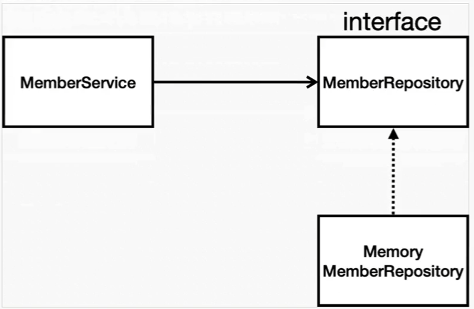

# 회원 관리 예제- 백엔드 개발

## 비즈니스 요구사항 정리

- 데이터: 회원ID, 이름
- 기능: 회원 등록, 조회
- 아직 데이터 저장소가 선정되지 않음(가상의 시나리오)

### 일반적인 웹 애플리케이션 계층 구조


- 컨트롤러: 웹 MVC의 컨트롤러 역할
- 서비스: 핵심 비즈니스 로직 구현
- 리포지토리: 데이터베이스에 접근, 도메인 객체를 DB에 저장하고 관리
- 도메인: 비즈니스 도메인 객체
    - 예) 회원, 주문, 쿠폰 등등 주로 데이터베이스에 저장하고 관리됨

### 클래스 의존 관계



- 아직 데이터 저장소가 선정되지 않아서 우선 **인터페이스**로 구현 클래스를 변경할 수 있도록 설계
- 데이터 저장소는 RDB, NoSQL 등등 다양한 저장소를 고민중인 상황으로 가정
- 개발을 진행하기 위해서 초기 개발 단계에서는 구현체로 가벼운 메모리 기반의 데이터 저장소 사용

## 회원 도메인과 리포지토리 만들기

```java

package hello.hello_spring.repository;
import hello.hello_spring.domain.Member;
import java.util.*;

public class MemoryMemberRepository implements MemberRepository{

    private static Map<Long, Member> store = new HashMap<>(); //회원 정보를 저장
    private static long sequence = 0L; //회원 id 생성할 때 사용할 sequence 변수

    //회원 정보 저장 메서드
    @Override
    public Member save(Member member) {
        member.setId(++sequence); //id 세팅
        store.put(member.getId(), member); //store에 저장
        return member;
    }

    //id로 회원 정보 찾는 메서드
    @Override
    public Optional<Member> findByID(Long id) {
        return Optional.ofNullable(store.get(id)); //Optional.ofNullable() 반환값이 null일 가능성 처리
    }

    //이름으로 회원 정보 찾는 메서드
    @Override
    public Optional<Member> findByName(String name) {
        return store.values().stream() //Map의 values()로 모든 회원 목록을 stream으로 반환
                .filter(member -> member.getName().equals(name)) //이름이 일치하는 회원 필터링
                .findAny(); //조건에 맞는 회원 찾으면 반환
    }

    //저장된 모든 회원 정보를 리스트로 반환
    @Override
    public List<Member> findAll() {
        return new ArrayList<>(store.values()); //member들 반환
    }
}

```

## 회원 리포지토리 테스트 케이스 작성

개발한 기능을 실행해서 테스트 할 때 자바의 main메서드를 통해서 실행하거나, 웹 애플리케이션의 컨트롤러를 통해서 해당 기능을 실행한다.

이러한 방법은 준비하고 실행하는 데 오래 걸리고, 반복 실행하기 어렵고 여러 테스트를 한 번에 실행하기 어렵다는 단점이 있다.

자바는 JUnit이라는 프레임워크로 테스트를 실행해서 이러한 문제를 해결한다.

### 회원 리포지토리 메모리 구현체 테스트

```java
package hello.hello_spring.repository;

import hello.hello_spring.domain.Member;
import org.junit.jupiter.api.AfterEach;
import org.junit.jupiter.api.Assertions;
import org.junit.jupiter.api.Test;

import java.util.List;
import java.util.Optional;

import static org.assertj.core.api.Assertions.*;

public class MemoryMemberRepositoryTest {
    MemoryMemberRepository repository = new MemoryMemberRepository();

    @AfterEach
    public void afterEach() {
        repository.clearStore();
    }

    //save()기능 테스트
    @Test
    public void save() {
        Member member = new Member();
        member.setName("spring");

        repository.save(member); // member 저장

        Member result = repository.findByID(member.getId()).get(); //저장된 회원의 id로 다시 조회해서 회원 정보 가져오기

        // 저장된 회원과 조회한 회원이 동일한지 확인
        //System.out.println("result = "+(result == member));
        Assertions.assertEquals(member, result);
        assertThat(member).isEqualTo(result);
        assertThat(member).isEqualTo(null); //테스트 실패

    }
    
    // findByName() 메서드의 기능을 테스트
    @Test
    public void findByname() {
        Member member1 = new Member();
        member1.setName("spring1");
        repository.save(member1);

        Member member2 = new Member(); // shift+F6: RENAME
        member2.setName("spring2");
        repository.save(member2);

        Member result = repository.findByName("spring1").get();

        assertThat(result).isEqualTo(member1);

    }

    // findAll() 메서드의 기능을 테스트
    @Test
    public void findAll() {
        Member member1 = new Member();
        member1.setName("spring1");
        repository.save(member1);

        Member member2 = new Member();
        member2.setName("spring2");
        repository.save(member2);

        List<Member> result = repository.findAll();
        assertThat(result.size()).isEqualTo(2); // 저장된 회원 수가 2명인지 검증
    }
}
```

- `clearStore()`

```java
// MemoryMemberRepository.java

    // 테스트가 끝난 후 저장소를 비우기
    public void clearStore() {
        store.clear();
    }
```

```java
// MemoryMemberRepositoryTest.java

    // 각 테스트가 끝난 후 실행되는 메서드
    @AfterEach
    public void afterEach() {
        repository.clearStore();
    }
```

`@AfterEach`: 각 테스트가 끝날 때마다 저장소를 비우기

## 회원 서비스 개발

```java
//MemberService.java

package hello.hello_spring.service;

import hello.hello_spring.domain.Member;
import hello.hello_spring.repository.MemberRepository;
import hello.hello_spring.repository.MemoryMemberRepository;

import java.util.List;
import java.util.Optional;

public class MemberService {

    private final MemberRepository memberRepository = new MemoryMemberRepository();

    /* 회원가입 */
    public Long join(Member member) {

        //같은 이름이 있는 중복 회원 없는지 체크
        validateDuplicateMember(member);
        
        memberRepository.save(member); //회원 정보 저장
        return member.getId(); //저장된 회원의 id 반환
    }
    
    //중복 회원 체크하는 메서드
    private void validateDuplicateMember(Member member) {
        //memberRepository에서 같은 이름 가진 회원 조회
        memberRepository.findByName(member.getName())
                        .ifPresent(m -> {
                            throw new IllegalStateException("이미 존재하는 회원입니다.");
                        });
    }

    /* 전체 회원 조회 */
    public List<Member> findMembers() {
        return memberRepository.findAll();
    }
    
    /* id로 회원 정보 조회 */
    public Optional<Member> findOne(Long memberId) {
        return memberRepository.findByID(memberId);
    }

}
```

## 회원 서비스 테스트

`Ctrl` + `Shift` + `T` : 테스트 클래스 생성 단축키

given(주어진 상황) - when(이걸 실행했을 때) - then(나오는 결과) 형식으로 코드를 짜기

```java
// MemberServiceTest.java

    MemberService memberService;
    MemoryMemberRepository memberRepository;

    @BeforeEach
    public void beforeEach() {
        memberRepository = new MemoryMemberRepository();
        memberService = new MemberService(memberRepository);

    }

    @AfterEach
    public void afterEach() {
        memberRepository.clearStore();
    }

    @Test
    void 회원가입() { //Test 메서드 이름은 한글로 적어도 무방
        //given
        Member member = new Member();
        member.setName("hello"); //회원 이름 hello로 설정

        //when
        Long saveId = memberService.join(member); //회원가입 메서드 호출

        //then
        Member findMember = memberService.findOne(saveId).get();
        Assertions.assertThat(member.getName()).isEqualTo(findMember.getName());
    }

    @Test
    public void 중복회원예외(){
        //given
        Member member1 = new Member();
        member1.setName("spring");
        Member member2 = new Member();
        member2.setName("spring");

        //when
        memberService.join(member1);

        //then
        IllegalStateException e = assertThrows(IllegalStateException.class, () -> memberService.join(member2));
        Assertions.assertThat(e.getMessage()).isEqualTo("이미 존재하는 회원입니다.");
    }
```

- assertThrows

```java
assertThrows( 예외 클래스, 예외가 발생할 것으로 예상되는 코드 블록 )
```

- 람다 표현식

```java
(매개변수1, 매개변수2, ...) -> { 실행할 코드 }
```

### Dependency Injection

- 수정 전

```java
// MemberService.java

    private final MemberRepository memberRepository = new MemoryMemberRepository();
```

```java
// MemberServiceTest.java

    MemberService memberService = new MemberService();
```

- 수정 후

```java
// MemberService.java

    private final MemberRepository memberRepository;

    public MemberService(MemberRepository memberRepository) { //dependency injection
        this.memberRepository = memberRepository;
    }
```

```java
// MemberServiceTest.java

    MemberService memberService;
    MemoryMemberRepository memberRepository;

    @BeforeEach
    public void beforeEach() {
        memberRepository = new MemoryMemberRepository();
        memberService = new MemberService(memberRepository);

    }
```