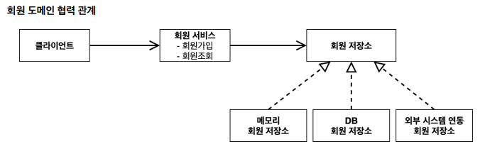

# 스프링 핵심 원래 이해1- 예제 만들기

강의 시간: 1시간 1분
날짜: 2024년 10월 6일
상태: 완료

## 프로젝트 생성

### 스프링 부트 스타터

https://start.spring.io/

- 프로젝트 선택
    - Project: Gradle - Groovy Project
    - Spring Boot: 3.x.x
    - Language: Java
    - Packaging: Jar
    - Java: 17 또는 21
- Project Metadata
    - groupId: hello
    - artifactId: core
- Dependencies
    - 선택하지 않는다.

## 비즈니스 요구사항과 설계

- 회원
    - 회원을 가입하고 조회
    - 회원은 일반과 VIP 두 가지 등급
    - 회원 데이터는 자체 DB를 구축할 수 있고, 외부 시스템과 연동할 수 있다.(미확정)
- 주문과 할인 정책
    - 회원은 상품을 주문할 수 있다.
    - 회원 등급에 따라 할인 정책을 적용할 수 있다.
    - 할인 정책은 모든 VIP는 1000원을 할인해주는 고정 금액 할인을 적용해달라.(나중에 변경 될 수 있다.)
    - 할인 정책은 변경 가능성이 높다. 회사의 기본 할인 정책을 아직 정하지 못했고, 오픈 직전까지 고민을 미루고 싶다. 최악의 경우 할인을 적용하지 않을수도 있다.(미확정)

## 회원 도메인 설계




## 회원 도메인 개발

```java
// Grade.java

package hello.core.member;

public enum Grade {
    BASIC,
    VIP
}
```

enum(열거형): 서로 관련 있는 상수들의 집합을 정의할 때 사용하는 특별한 자료형

```java
// Member.java

package hello.core.member;

public class Member {

    private Long id;
    private String name;
    private Grade grade;

    public Member(Long id, String name, Grade grade) {
        this.id = id;
        this.name = name;
        this.grade = grade;
    }

    public Long getId() {
        return id;
    }

    public void setId(Long id) {
        this.id = id;
    }

    public String getName() {
        return name;
    }

    public void setName(String name) {
        this.name = name;
    }

    public Grade getGrade() {
        return grade;
    }

    public void setGrade(Grade grade) {
        this.grade = grade;
    }
}
```

```java
//MemberRepository.java

package hello.core.member;

public interface MemberRepository {

    void save(Member member); // 회원을 저장하는 기능

    Member findById(Long memberId); // 회원을 찾는 기능
}
```

두 가지 메서드 `save`와 `findById` 선언

인터페이스는 메서드의 구현(실제 동작)은 없고 어떤 기능을 제공할 것인지만 정의하는 역할을 함

- `void save(Member member);`
    
     void : 값을 반환하지 않고 저장동작만 수행한다.
    
- `Member findById(Long memberId);`
    
    Member객체를 반환
    

```java
package hello.core.member;

import java.util.HashMap;
import java.util.Map;

public class MemoryMemberRepository implements MemberRepository {

    private static Map<Long, Member> store = new HashMap<>();
    
    @Override
    public void save(Member member) {
        store.put(member.getId(), member);
    }

    @Override
    public Member findById(Long memberId) {
        return store.get(memberId);
    }
}
```

- `private static Map<Long, Member> store = new HashMap<>();`
    - `store`: 회원 정보를 저장하는 메모리 공간
        
        hashmap을 사용해서 회원id를 key로 하고 member객체를 value로 저장
        
    - `static`: 클래스이 모든 인스턴스가 공유하는 하나의 store을 사용
        
        여러 개의 MemoryMemberRepository 객체가 생성되어도 store은 하나만 존재한다.
        

> `HashMap`은 동시성 이슈가 발생할 수 있음 ⇒ `ConcurrentHashMap` 사용
> 

```java
//MemberService.java

package hello.core.member;

public interface MemberService {
    
    void join(Member member); //회원 가입

    Member findMember(Long memberId); //회원 조회
}
```

```java
//MemberServiceImpl.java

package hello.core.member;

public class MemberServiceImpl implements MemberService {

    private final MemberRepository memberRepository = new MemoryMemberRepository();
    
    @Override
    public void join(Member member) {
        memberRepository.save(member);    
    }

    @Override
    public Member findMember(Long memberId) {
        return memberRepository.findById(memberId);
    }
}
```

## 회원 도메인 실행과 테스트

```java
//MemberApp.java

package hello.core;

import hello.core.member.Grade;
import hello.core.member.Member;
import hello.core.member.MemberService;
import hello.core.member.MemberServiceImpl;

public class MemberApp {
    public static void main(String[] args) {
        MemberService memberService = new MemberServiceImpl();
        Member member = new Member(1L, "memberA", Grade.VIP);
        memberService.join(member);

        Member findMember = memberService.findMember(1L);
        System.out.println("new member = "+member.getName()); //new member = memberA
        System.out.println("find member = "+findMember.getName()); //find member = memberA        
    }
}
```

좋은 방법이 아님

→ JUnit 테스트 사용

```java
//MemberServiceTest.java

package hello.core.member;

import org.assertj.core.api.Assertions;
import org.junit.jupiter.api.Test;

public class MemberServiceTest {

    MemberService memberService = new MemberServiceImpl();

    @Test
    void join() {
        //given
        Member member = new Member(1L, "memberA", Grade.VIP);

        //when
        memberService.join(member);
        Member findMember = memberService.findMember(1L);

        //then
        Assertions.assertThat(member).isEqualTo(findMember); // run 성공하면 테스트 성공!
    }
}
```

- 회원 도메인 설계의 문제점

의존관계가 인터페이스 뿐만 아니라 구현까지 모두 의존하는 문제점이 있음

- ChatGPT
    
    회원 도메인 설계에서 "의존관계가 인터페이스뿐만 아니라 구현까지 모두 의존한다"라는 문제점은 **MemberService**가 **MemberRepository 인터페이스**뿐만 아니라, 그 구체적인 **구현체(implementation)**에도 의존하고 있다는 뜻이야. 이 문제점은 **유연성 부족**과 **테스트 어려움**을 초래할 수 있어.
    
    ### 1. **현재 코드의 의존 관계 문제**
    
    ```java
    MemberService memberService = new MemberServiceImpl();
    
    ```
    
    이 부분에서 **MemberServiceTest** 클래스는 `MemberServiceImpl` 클래스의 구체적인 구현체를 직접 생성하고 있어. 다시 말해, 테스트 코드에서 `MemberService` 인터페이스만 의존하는 것이 아니라, `MemberServiceImpl`의 구현에까지 직접적으로 의존하고 있다는 의미야. 이 문제는 더 깊이 보면 **MemberServiceImpl**이 `MemoryMemberRepository` 같은 특정 구현체에도 의존하고 있을 가능성이 커.
    
    **MemberServiceImpl**에서 구체적인 `MemberRepository` 구현체가 하드코딩되어 있으면, `MemberServiceImpl`은 `MemoryMemberRepository` 외에 다른 구현체 (예: `JdbcMemberRepository`, `JpaMemberRepository`)로 변경하기 어렵고, 테스트할 때도 특정 구현체에 강하게 결합되어 있기 때문에 테스트 유연성이 떨어져.
    
    ### 예시 코드:
    
    ```java
    public class MemberServiceImpl implements MemberService {
        private final MemberRepository memberRepository = new MemoryMemberRepository();
    }
    
    ```
    
    위 코드에서 `MemberServiceImpl`은 인터페이스인 `MemberRepository`뿐만 아니라 그 구체적인 구현체인 `MemoryMemberRepository`에도 의존하고 있어. 이로 인해 **구체적인 클래스에 의존하는 구조**가 되어버린 거지.
    
    ### 2. **왜 이게 문제인가?**
    
    - **확장성 부족**: 만약 `MemoryMemberRepository` 대신 `JdbcMemberRepository`나 `JpaMemberRepository` 같은 다른 구현체로 변경하고 싶다면, `MemberServiceImpl` 내부의 코드를 직접 수정해야 해. 이렇게 되면, 코드 수정 없이 다른 구현체로 바꿀 수 있는 유연성이 사라져.
    - **테스트의 어려움**: 테스트 시 `MemoryMemberRepository`에 의존하기 때문에, 다른 환경(예: 데이터베이스 환경)에서는 테스트가 실패할 가능성이 있어. 테스트를 하려면 해당 구현체의 동작에 의존해야 하므로, 가짜 객체(mock)를 쉽게 주입할 수 없어.
    
    Django와 비교하자면, Django는 **ORM**을 통해 모델이 데이터베이스와 자동으로 연결돼, 데이터베이스를 바꾸더라도 ORM 코드 자체는 수정할 필요가 없어. 이런 구조는 인터페이스와 구현 분리가 잘 되어 있는 것과 유사한 개념이야.
    
    ### 3. **문제 해결 방법: 의존성 주입(DI, Dependency Injection)**
    
    이 문제를 해결하려면 **의존성 주입**(Dependency Injection)이라는 방법을 사용해, **구체적인 구현체에 의존하지 않고 인터페이스에만 의존하도록** 설계를 개선할 수 있어.
    
    ### 수정된 코드:
    
    ```java
    public class MemberServiceImpl implements MemberService {
        private final MemberRepository memberRepository;
    
        public MemberServiceImpl(MemberRepository memberRepository) {
            this.memberRepository = memberRepository;
        }
    
        @Override
        public void join(Member member) {
            memberRepository.save(member);
        }
    
        @Override
        public Member findMember(Long memberId) {
            return memberRepository.findById(memberId);
        }
    }
    
    ```
    
    이렇게 수정하면 `MemberServiceImpl`은 `MemberRepository`라는 **인터페이스**에만 의존하고, 구체적인 구현체(`MemoryMemberRepository`, `JdbcMemberRepository` 등)는 생성자를 통해 외부에서 주입받게 돼. 이렇게 하면 `MemberServiceImpl`은 구현체에 강하게 결합되지 않아서, 나중에 **구현체를 자유롭게 교체**할 수 있어.
    
    ### 4. **테스트 코드 개선**
    
    테스트 코드에서도 유연하게 구현체를 주입받을 수 있게 돼.
    
    ```java
    public class MemberServiceTest {
    
        MemberRepository memberRepository = new MemoryMemberRepository();
        MemberService memberService = new MemberServiceImpl(memberRepository); // 구현체 주입
    
        @Test
        void join() {
            //given
            Member member = new Member(1L, "memberA", Grade.VIP);
    
            //when
            memberService.join(member);
            Member findMember = memberService.findMember(1L);
    
            //then
            Assertions.assertThat(member).isEqualTo(findMember);
        }
    }
    
    ```
    
    이렇게 하면 테스트 시 원하는 구현체(`MemoryMemberRepository`)를 직접 주입할 수 있고, 필요에 따라 가짜 객체(mock)를 넣어서 테스트할 수도 있어. 또한, 다른 저장소 구현체를 사용하는 경우에도 `MemberServiceImpl` 코드를 수정할 필요가 없어져.
    
    ### 5. **Django와의 비교**
    
    Django에서는 ORM이 기본적으로 데이터베이스에 의존성을 주입해 주는 것처럼 동작해. 즉, 모델 클래스는 데이터베이스 설정이 바뀌더라도 수정할 필요가 없어. Java의 DI는 Django에서 모델을 사용하듯이 다양한 구현체로부터 데이터를 가져오는 방식과 비슷한 역할을 해.
    
    정리하자면, "의존관계가 구현체에까지 의존한다"는 문제점은 **MemberService**가 인터페이스뿐 아니라 **구체적인 구현체에도 강하게 결합**되어 있다는 것을 의미해. 이를 해결하려면 **의존성 주입(DI)**을 통해 인터페이스에만 의존하도록 개선하는 것이 좋아.
    

## 주문과 할인 도메인 설계


1. 주문 생성: 클라이언트는 주문 서비스에 주문 생성을 요청한다.
2. 회원 조회: 할인을 위해서는 회원 등급이 필요하다. 그래서 주문 서비스는 회원 저장소에서 회원을 조회한다.
3. 할인 적용: 주문 서비스는 회원 등급에 따른 할인 여부를 할인 정책에 위임한다.
4. 주문 결과 반환: 주문 서비스는 할인 결과를 포함한 주문 결과를 반환한다.


역할과 구현을 분리해서 자유롭게 구현 객체를 조립할 수 있게 설계했다. 

덕분에 회원 저장소는 물론이고, 할인 정책도 유연하게 변경할 수 있다.


회원을 메모리에서 조회하고, 정액 할인 정책(고정 금액)을 지원해도 주문 서비스를 변경하지 않아도 된다.

역할들의 협력 관계를 그대로 재사용 할 수 있다.


회원을 메모리가 아닌 실제 DB에서 조회하고, 정률 할인 정책(주문 금액에 따라 % 할인)을 지원해도 주문 서비스를 변경하지 않아도 된다.

협력 관계를 그대로 재사용 할 수 있다.

## 주문과 할인 도메인 개발

```java
//DiscountPolicy.java

package hello.core.discount;

import hello.core.member.Member;

public interface DiscountPolicy {

    /**
    * @return 할인 대상 금액
    */
    int discount(Member member, int price);

}
```

```java
//FixDiscountPolicy.java

package hello.core.discount;

import hello.core.member.Grade;
import hello.core.member.Member;

public class FixDiscountPolicy implements DiscountPolicy {

    private int discountFixAmount = 1000; //1000원 할인

    @Override
    public int discount(Member member, int price) {
        if (member.getGrade() == Grade.VIP) {
            return discountFixAmount;
        } else {
            return 0;
        }
    }
}
```

```java
//Order.java

package hello.core.order;

public class Order {

    private Long memberId;
    private String itemName;
    private int itemPrice;
    private int discountPrice;

    public int calculatePrice() { //계산된 금액
        return itemPrice - discountPrice;
    }

    //Getter Setter
    public String getItemName() {
        return itemName;
    }

    public void setItemName(String itemName) {
        this.itemName = itemName;
    }

    public Long getMemberId() {
        return memberId;
    }

    public void setMemberId(Long memberId) {
        this.memberId = memberId;
    }

    public int getItemPrice() {
        return itemPrice;
    }

    public void setItemPrice(int itemPrice) {
        this.itemPrice = itemPrice;
    }

    public int getDiscountPrice() {
        return discountPrice;
    }

    public void setDiscountPrice(int discountPrice) {
        this.discountPrice = discountPrice;
    }

    public Order(Long memberId, String itemName, int itemPrice, int discountPrice) {
        this.memberId = memberId;
        this.itemName = itemName;
        this.itemPrice = itemPrice;
        this.discountPrice = discountPrice;
    }

    @Override
    public String toString() { //보기 쉽게 하기 위해
        return "Order{" +
                "memberId=" + memberId +
                ", itemName='" + itemName + '\'' +
                ", itemPrice=" + itemPrice +
                ", discountPrice=" + discountPrice +
                '}';
    }
}
```

```java
//OrderService.java

package hello.core.order;

public interface OrderService {
    Order createOrder(Long memberId, String itemName, int itemPrice);
}
```

```java
//OrderServiceImpl.java

package hello.core.order;

import hello.core.discount.DiscountPolicy;
import hello.core.discount.FixDiscountPolicy;
import hello.core.member.Member;
import hello.core.member.MemberRepository;
import hello.core.member.MemoryMemberRepository;

public class OrderServiceImpl implements OrderService {

    private final MemberRepository memberRepository = new MemoryMemberRepository(); //회원
    private final DiscountPolicy discountPolicy = new FixDiscountPolicy(); //고정 할인 정책

    @Override
    public Order createOrder(Long memberId, String itemName, int itemPrice) {
        Member member = memberRepository.findById(memberId);
        int discountPrice = discountPolicy.discount(member, itemPrice);

        return new Order(memberId, itemName, itemPrice, discountPrice);
    }
}
```

주문 생성 요청이 오면, 회원 정보를 조회하고, 할인 정책을 적용한 다음 주문 객체를 생성해서 반환한다.
메모리 회원 리포지토리와, 고정 금액 할인 정책을 구현체로 생성한다.

## 주문과 할인 도메인 실행과 테스트

```java
//OrderApp.java

package hello.core;

import hello.core.member.Grade;
import hello.core.member.Member;
import hello.core.member.MemberService;
import hello.core.member.MemberServiceImpl;
import hello.core.order.Order;
import hello.core.order.OrderService;
import hello.core.order.OrderServiceImpl;

public class OrderApp {

    public static void main(String[] args) {
        MemberService memberService = new MemberServiceImpl();
        OrderService orderService = new OrderServiceImpl();

        Long memberId = 1L;
        Member member = new Member(memberId, "memberA", Grade.VIP);
        memberService.join(member);

        Order order = orderService.createOrder(memberId, "itemA", 10000);

        System.out.println("order = " + order); // Order{memberId=1, itemName='itemA', itemPrice=10000, discountPrice=1000}
//        System.out.println("order = " + order.calculatePrice()); // 9000
    }
}
```

애플리케이션 로직으로 이렇게 테스트 하는 것은 좋은 방법이 아니다. JUnit 테스트를 사용하자.

```java
//OrderServiceTest.java

package hello.core.order;

import hello.core.member.Grade;
import hello.core.member.Member;
import hello.core.member.MemberService;
import hello.core.member.MemberServiceImpl;
import org.assertj.core.api.Assertions;
import org.junit.jupiter.api.Test;

public class OrderServiceTest {

    MemberService memberService = new MemberServiceImpl();
    OrderService orderService = new OrderServiceImpl();

    @Test
    void createOrder() {
        Long memberId = 1L;
        Member member = new Member(memberId, "memberA", Grade.VIP);
        memberService.join(member);

        Order order = orderService.createOrder(memberId, "itemA", 10000);
        Assertions.assertThat(order.getDiscountPrice()).isEqualTo(1000);
    }
}
```

구조를 뭔가 이제 살 ~ 짝 알 것 같기도 하다.