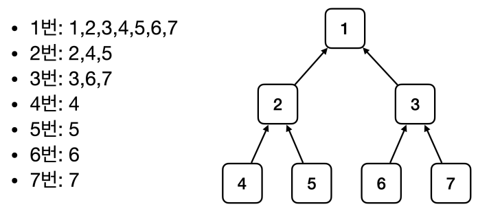
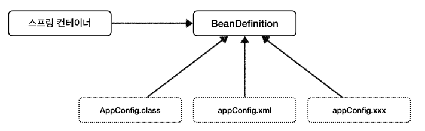

# 스프링 컨테이너와 스프링 빈

강의 시간: 1시간 19분
날짜: 2024년 10월 7일
상태: 진행 중

## 스프링 컨테이너 생성

### 스프링 컨테이너가 생성되는 과정

```java
ApplicationContext applicationContext = new AnnotationConfigApplicationContext(AppConfig.class);
```

- `ApplicationContext`를 스프링 컨테이너라 한다.
- `ApplicationContext`는 인터페이스이다.
- 스프링 컨테이너는 XML을 기반으로 만들 수 있고, 애노테이션 기반의 자바 설정 클래스로 만들 수 있다.
- 직전에 `AppConfig`를 사용했던 방식이 애노테이션 기반의 자바 설정 클래스로 스프링 컨테이너를 만든 것이다.
- 자바 설정 클래스를 기반으로 스프링 컨테이너(`ApplicationContext`)를 만들어보자.
    - `new AnnotationConfigApplicationContext(AppConfig.class);`
    - 이 클래스는 `ApplicationContext` 인터페이스의 구현체이다.

### 스프링 컨테이너의 생성 과정

1. 스프링 컨테이너 생성
    1. `new AnnotationConfigApplicationContext(AppConfig.class)`
    2. 스프링 컨테이너 생성할 땐 구성 정보 지정(`AppConfig.class`)
2. 스프링 빈 등록
    1. `AppConfig.class`에서 `@Bean`
    2. 스프링 컨테이너는 파라미터로 넘어온 설정 클래스 정보를 사용해서 스프링 빈을 등록
    3. 빈 이름
        1. 빈 이름은 메서드 이름을 사용
        2. 직접 부여할 수도 있음(`@Bean(name=”memberService2”)`)
        3. 빈 이름은 항상 다른 이름을 부여해야 함
3. 스프링 빈 의존관계 설정
    
    ```java
    // AppConfig.java
    
    @Configuration
    public class AppConfig {
        @Bean
        public MemberService memberService() {
            return new MemberServiceImpl(memberRepository());
        }
    
        @Bean
        public MemoryMemberRepository memberRepository() {
            return new MemoryMemberRepository();
        }
    
        @Bean
        public OrderService orderService() {
            return new OrderServiceImpl(memberRepository(), discountPolicy());
        }
    
        @Bean
        public DiscountPolicy discountPolicy() {
            return new RateDiscountPolicy();
        }
    }
    ```
    
    1. 설정 정보를 참고해서 의존관계를 주입

## 컨테이너에 등록된 모든 빈 조회

```java
package hello.core.beanfind;

import hello.core.AppConfig;
import org.junit.jupiter.api.DisplayName;
import org.junit.jupiter.api.Test;
import org.springframework.beans.factory.config.BeanDefinition;
import org.springframework.context.annotation.AnnotationConfigApplicationContext;

public class ApplicationContextInfoTest {

    AnnotationConfigApplicationContext ac= new AnnotationConfigApplicationContext(AppConfig.class);

    @Test
    @DisplayName("모든 빈 출력하기")
    void findAllBean() {
        String[] beanDefinitionNames = ac.getBeanDefinitionNames();
        for (String beanDefinitionName : beanDefinitionNames) {
            Object bean = ac.getBean(beanDefinitionName);
            System.out.println("name = " + beanDefinitionName + " object = " + bean);
        }
    }
```

- 모든 빈 출력하기
    - 실행하면 스프링에 등록된 모든 빈 정보 출력
    - `ac.getBeanDefinitionNames()`: 스프링에 등록된 모든 빈 이름 조회
    - `ac.getBean()`: 빈 이름으로 빈 객체(인스턴스)를 조회

```java
    @Test
    @DisplayName("애플리케이션 빈 출력하기")
    void findApplicationBean() {
        String[] beanDefinitionNames = ac.getBeanDefinitionNames();
        for (String beanDefinitionName : beanDefinitionNames) {
            BeanDefinition beanDefinition = ac.getBeanDefinition(beanDefinitionName);

            if (beanDefinition.getRole() == BeanDefinition.ROLE_APPLICATION) {
                Object bean = ac.getBean(beanDefinitionName);
                System.out.println("name = " + beanDefinitionName + " object = " + bean);
            }
        }
    }
```

- 애플리케이션 빈 출력하기
    - 스프링이 내부에서 사용하는 빈은 제외하고, 내가 등록한 빈만 출력
    - 스프링이 내부에서 사용하는 빈은 `getRole()`로 구분
        - `ROLE_APPLICATION`: 일반적으로 사용자가 정의한 빈
        - `ROLE_INFRASTRUCTURE`: 스프링이 내부에서 사용하는 빈

## 스프링 빈 조회- 기본

- 스프링 빈을 조회하는 가장 기본적인 조회 방법
    - `ac.getBean(빈 이름, 타입)`
    - `ac.getBean(타입)`
    - 조회 대상 스프링 빈이 없으면 예외 발생
        - `NoSuchBeanDefinitionException: No bean named 'xxxxx' available`

```java
//ApplicationContextBasicFindTest.java

package hello.core.beanfind;

import hello.core.AppConfig;
import hello.core.member.Member;
import hello.core.member.MemberService;
import hello.core.member.MemberServiceImpl;
import org.junit.jupiter.api.Assertions;
import org.junit.jupiter.api.DisplayName;
import org.junit.jupiter.api.Test;
import org.springframework.beans.factory.NoSuchBeanDefinitionException;
import org.springframework.context.annotation.AnnotationConfigApplicationContext;

import static org.assertj.core.api.Assertions.assertThat;
import static org.junit.jupiter.api.Assertions.assertThrows;

public class ApplicationContextBasicFindTest {
    AnnotationConfigApplicationContext ac = new AnnotationConfigApplicationContext(AppConfig.class);

    @Test
    @DisplayName("빈 이름으로 조회")
    void findBeanByName() {
        MemberService memberService = ac.getBean("memberService", MemberService.class);
//        System.out.println("memberService = " + memberService);
//        System.out.println("memberService.getClass() = " + memberService.getClass());
        assertThat(memberService).isInstanceOf(MemberServiceImpl.class);
    }

    @Test
    @DisplayName("이름 없이 타입으로만 조회")
    void findBeanByType() {
        MemberService memberService = ac.getBean(MemberService.class);
        assertThat(memberService).isInstanceOf(MemberServiceImpl.class);
    }

    @Test
    @DisplayName("구체 타입으로 조회")
    void findBeanByName2() {
        MemberService memberService = ac.getBean("memberService", MemberServiceImpl.class);
        assertThat(memberService).isInstanceOf(MemberServiceImpl.class);
    }

    @Test
    @DisplayName("빈 이름으로 조회X")
    void findBeanByNameX() {
//        MemberService xxxxx = ac.getBean("xxxxx", MemberService.class);
        assertThrows(NoSuchBeanDefinitionException.class,
                ()->ac.getBean("xxxxx", MemberService.class));

    }
}
```

## 스프링 빈 조회- 동일한 타입이 둘 이상

- 타입으로 조회시 같은 타입의 스프링 빈이 둘 이상이면 오류가 발생한다. 이 때는 빈 이름을 지정
- `ac.getBeansOfType()`을 사용하면 해당 타입의 모든 빈을 조회할 수 있다.

```java
// ApplicationContextSameBeanFindTest.java

package hello.core.beanfind;

import hello.core.AppConfig;
import hello.core.discount.DiscountPolicy;
import hello.core.member.MemberRepository;
import hello.core.member.MemoryMemberRepository;
import org.junit.jupiter.api.Assertions;
import org.junit.jupiter.api.DisplayName;
import org.junit.jupiter.api.Test;
import org.springframework.beans.factory.NoUniqueBeanDefinitionException;
import org.springframework.context.annotation.AnnotationConfigApplicationContext;
import org.springframework.context.annotation.Bean;
import org.springframework.context.annotation.Configuration;

import java.util.Map;

import static org.assertj.core.api.Assertions.assertThat;

public class ApplicationContextSameBeanFindTest {
    AnnotationConfigApplicationContext ac = new AnnotationConfigApplicationContext(SameBeanConfig.class);

    @Test
    @DisplayName("타입으로 조회 시 같은 타입이 둘 이상 있으면 중복 오류가 발생한다.")
    void findBeanByTypeDuplicate() {
        Assertions.assertThrows(NoUniqueBeanDefinitionException.class,
                ()-> ac.getBean(MemberRepository.class));
    }

    @DisplayName("타입으로 조회 시 같은 타입이 둘 이상 있으면, 빈 이름을 지정하면 된다.")
    void findBeanByName() {
        MemberRepository memberRepository = ac.getBean("memberRepository1", MemberRepository.class);
        assertThat(memberRepository).isInstanceOf(MemberRepository.class);
    }

    @Test
    @DisplayName("특정 타입을 모두 조회하기")
    void findAllBeanByType() {
        Map<String, MemberRepository> beansOfType = ac.getBeansOfType(MemberRepository.class);
        for (String key : beansOfType.keySet()) {
            System.out.println("key = " + key + " value = " + beansOfType.get(key));
        }
        System.out.println("beansOfType = " + beansOfType);
        assertThat(beansOfType.size()).isEqualTo(2);
    }

    @Configuration
    static class SameBeanConfig {

        @Bean
        public MemberRepository memberRepository1() {
            return new MemoryMemberRepository();
        }

        @Bean
        public MemberRepository memberRepository2() {
            return new MemoryMemberRepository();
        }
    }
}
```

⇒ 빈 이름을 명시적으로 지정하거나 특정 타입의 모든 빈을 조회하기

## 스프링 빈 조회- 상속 관계

- 부모 타입으로 조회하면 → 자식 타입도 함께 조회한다.
- 그래서 모든 자바 객체의 최고 부모인 `Object`타입으로 조회하면 모든 스프링 빈을 조회하게 된다.



```java
// ApplicationContextExtendFindTest.java

package hello.core.beanfind;

import hello.core.discount.DiscountPolicy;
import hello.core.discount.FixDiscountPolicy;
import hello.core.discount.RateDiscountPolicy;
import org.junit.jupiter.api.Assertions;
import org.junit.jupiter.api.DisplayName;
import org.junit.jupiter.api.Test;
import org.springframework.beans.factory.NoUniqueBeanDefinitionException;
import org.springframework.context.annotation.AnnotationConfigApplicationContext;
import org.springframework.context.annotation.Bean;
import org.springframework.context.annotation.Configuration;

import java.util.Map;

import static org.assertj.core.api.Assertions.assertThat;
import static org.junit.jupiter.api.Assertions.assertThrows;

public class ApplicationContextExtendFindTest {

    AnnotationConfigApplicationContext ac = new AnnotationConfigApplicationContext(TestConfig.class);

    @Test
    @DisplayName("부모 타입으로 조회시, 자식이 둘 이상 있으면 중복 오류가 발생한다.")
    void findBeanByParentTypeDuplicate() {
//        DiscountPolicy bean = ac.getBean(DiscountPolicy.class);
        assertThrows(NoUniqueBeanDefinitionException.class,
                () -> ac.getBean(DiscountPolicy.class));
    }

    @Test
    @DisplayName("부모 타입으로 조회시, 자식이 둘 이상 있으면 빈 이름을 지정하면 된다.")
    void findBeanByParentTypeBeanName() {
        DiscountPolicy rateDiscountPolicy = ac.getBean("rateDiscountPolicy", DiscountPolicy.class);
        assertThat(rateDiscountPolicy).isInstanceOf(RateDiscountPolicy.class);
    }

    @Test
    @DisplayName("특정 하위 타입으로 조회")
    void findBeanBySubType() {
        RateDiscountPolicy bean = ac.getBean(RateDiscountPolicy.class);
        assertThat(bean).isInstanceOf(RateDiscountPolicy.class);
    }

    @Test
    @DisplayName("부모 타입으로 모두 조회하기")
    void findAllBeanByParentType() {
        Map<String, DiscountPolicy> beansOfType = ac.getBeansOfType(DiscountPolicy.class);
        assertThat(beansOfType.size()).isEqualTo(2);
        for (String key : beansOfType.keySet()) {
            System.out.println("key = " + key + " value = " + beansOfType.get(key));
        }
    }

    @Test
    @DisplayName("부모 타입으로 모두 조회하기 - Object")
    void findAllBeanByObjectType() {
        Map<String, Object> beansOfType = ac.getBeansOfType(Object.class);
        for (String key : beansOfType.keySet()) {
            System.out.println("key = " + key + " value = "+ beansOfType.get(key));
        }
    }

    @Configuration
    static class TestConfig {
        @Bean
        public DiscountPolicy rateDiscountPolicy() {
            return new RateDiscountPolicy();
        }

        @Bean
        public DiscountPolicy fixDiscountPolicy() {
            return new FixDiscountPolicy();
        }

    }
}
```

- 부모 타입으로 스프링 빈을 조회했을 때 자식 타입이 둘 이상이면 `NoUniqueBeanDefinitionException`이 발생
    
    ⇒ 빈 이름을 지정하거나, 특정 자식 타입으로 조회
    

## BeanFactory와 ApplicationContext

- BeanFactory나 ApplicationContext를 스프링 컨테이너 라고 함.
- BeanFactory를 직접 사용할 일은 거의 없다. 부가기능이 포함된 ApplicationContext를 사용한다.

### BeanFactory

- 스프링 컨테이너의 최상위 인터페이스
- 스프링 빈을 관리하고 조회하는 역할을 담당한다.
- `getBean()`을 제공

### ApplicationContext

- BeanFactory 기능을 모두 상속받아서 제공 (빈 관리 기능)
- 부가 기능
    - 메세지 소스를 활용한 국제화 기능
        - 한국에서 들어오면 한국어로, 영어권에서 들어오면 영어로 출력
    - 환경 변수
        - 로컬, 개발, 운영 등을 구분해서 처리
    - 애플리케이션 이벤트
        - 이벤트를 발행하고 구독하는 모델을 편리하게 지원
    - 편리한 리소스 조회
        - 파일, 클래스 패스, 외부 등에서 리소스를 편리하게 조회

## 다양한 설정 형식 지원- 자바 코드, XML

### 애노테이션 기반 자바 코드 설정 사용

- 지금까지 했던 것

### XML 설정

- 최근에는 사용하지 않음
- `GenericXmlApplicationContext`를 사용하면서 `xml` 설정 파일을 넘기면 된다.

## 스프링 빈 설정 메타 정보- BeanDefinition

- 빈 설정 메타 정보
    - `@Bean`, `<bean>`당 각각 하나씩 메타 정보가 생성된다.
    - 스프링 컨테이너는 이 메타정보를 기반으로 스프링 빈을 생성한다.
- 스프링 컨테이너가 빈을 관리하기 위해 필요한 설정 정보를 담고 있는 객체
- 스프링은 다양한 형태의 설정 정보를 `BeanDefinition`으로 추상화해서 사용한다.
- 역할과 구현을 개념적으로 나눈 것

