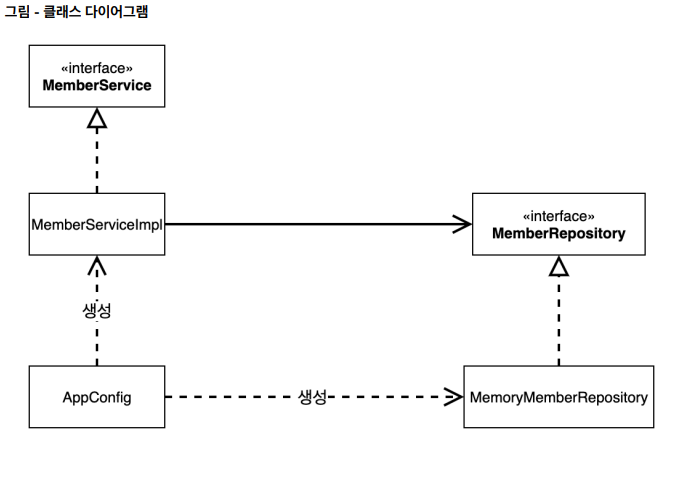
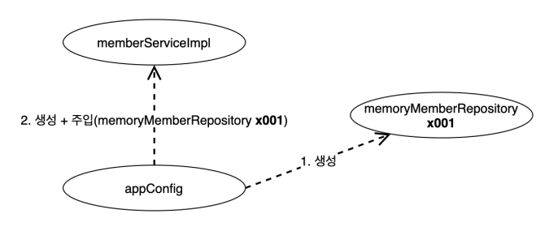
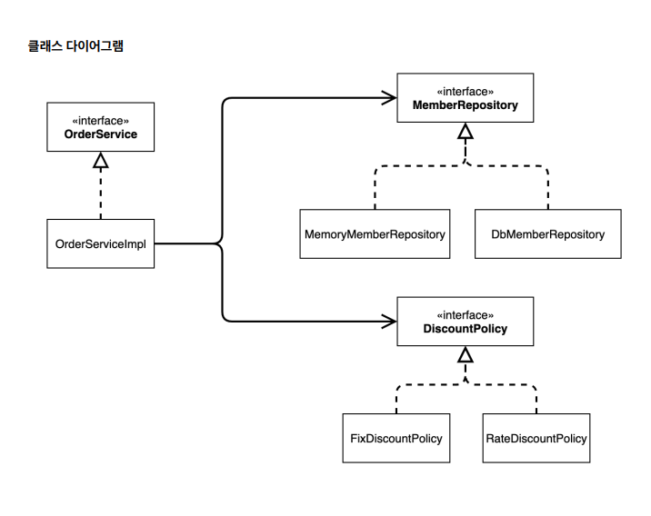
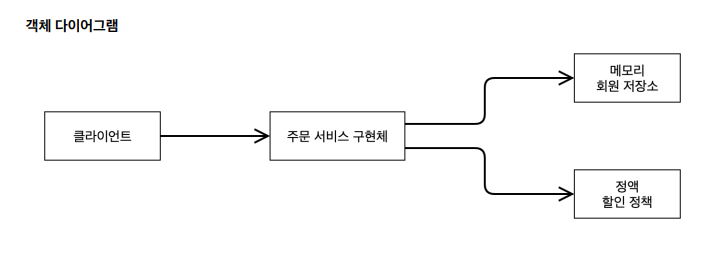

## 기존 코드 객체지향 원리 적용

## 새로운 할인 정책 개발
- 새로운 할인 정책을 확장해보기!
- 악덕 기획자: 서비스 오픈 직전에 할인 정책을 지금처럼 고정 금액 할인이 아니라 좀 더 합리적인 주문 금액당 할
- 인하는 정률% 할인으로 변경하고 싶어요. 예를 들어서 기존 정책은 VIP가 10000원을 주문하든 20000원을 주문하든 항상 1000원을 할인했는데, 이번에 새로 나온 정책은 10%로 지정해두면 고객이 10000원 주문시 1000원을 할인해주고, 20000원 주문시에 2000원을 할인해주는 거에요!

#### 에자일? 유연한 설계 필요한 이유?
- 순진 개발자: 제가 처음부터 고정 금액 할인은 아니라고 했잖아요.
- 악덕 기획자: `애자일 소프트웨어 개발 선언 몰라요?` “계획을 따르기보다 변화에 대응하기를”
- 순진 개발자: … (하지만 난 유연한 설계가 가능하도록 객체지향 설계 원칙을 준수했지 후후)

[애자일 소프트웨어 개발 선언](https://agilemanifesto.org/iso/ko/manifesto.html)

- 계획보다는 변화에 대응하기


## 관심사의 분리
- 애플리케이션을 하나의 공연이라 생각해보자. 각각의 인터페이스를 배역(배우 역할)이라 생각하자. 그런데! 실제 배역 맞는 배우를 선택하는 것은 누가 하는가?
- 로미오와 줄리엣 공연을 하면 로미오 역할을 누가 할지 줄리엣 역할을 누가 할지는 배우들이 정하는게 아니다. 이전 코드는 마치 로미오 역할(인터페이스)을 하는 레오나르도 디카프리오(구현체, 배우)가 줄리엣 역할(인터페이스)을 하는 여자 주인공(구현체, 배우)을 직접 초빙하는 것과 같다. 
    - 디카프리오는 공연도 해야하고 동시에 여자 주인공도 공연에 직접 초빙해야 하는 다양한 책임을 가지고 있다

### 관심사 분리가 필요함.
- 관심사를 분리하자!
- 배우는 본인의 역할인 배역을 수행하는 것에만 집중해야 한다.
- 디카프리오는 어떤 여자 주인공이 선택되더라도 똑같이 공연을 할 수 있어야 한다.
- 공연을 구성하고, 담당 배우를 섭외하고, 역할에 맞는 배우를 지정하는 책임을 담당하는 별도의 `공연 기획자가 나올시점`이다.
- 공연 기획자를 만들고, 배우와 공연 기획자의 책임을 확실히 분리하자.


## AppConfig 등장
- 생성자 주입을 할것임!!
- 애플리케이션의 전체 동작 방식을 구성(config)하기 위해, 구현 객체를 생성하고, 연결하는 책임을 가지는 별도의 설정 클래스를 만들자!!

- AppConfig는 애플리케이션의 실제 동작에 필요한 구현 객체를 생성한다.
    - MemberServiceImpl
    - MemoryMemberRepository
    - OrderServiceImpl
    - FixDiscountPolicy
- AppConfig는 생성한 객체 인스턴스의 참조(레퍼런스)를 생성자를 통해서 주입(연결)해준다.
    - MemberServiceImpl MemoryMemberRepository
    - OrderServiceImpl MemoryMemberRepository , FixDiscountPolicy
- 참고: 지금은 각 클래스에 생성자가 없어서 컴파일 오류가 발생한다. 바로 다음에 코드에서 생성자를 만든다.


### 설계 변경으로 MemberServiceImpl 은 더이상 MemoryMemberRepository 를 의존하지 않는다!
- 단지 MemberRepository 인터페이스만 의존한다.
- MemberServiceImpl 입장에서 생성자를 통해 어떤 구현 객체가 들어올지(주입될지)는 알 수 없다.
- MemberServiceImpl 의 생성자를 통해서 어떤 구현 객체를 주입할지는 오직 외부( AppConfig )에서 결정된다.
- MemberServiceImpl 은 이제부터 의존관계에 대한 고민은 외부에 맡기고 `실행에만 집중하면 된다.`


'

- `객체의 생성과 연결은 AppConfig 가 담당`한다.
- `DIP 완성`: `MemberServiceImpl` 은 `MemberRepository` 인 추상에만 의존하면 된다. 이제 구체 클래스를 몰라도 된다.
- `관심사의 분리`: 객체를 생성하고 연결하는 역할과 실행하는 역할이 명확히 분리되었다



```java
    public MemberService memberService(){
       return new MemberServiceImpl(new MemoryMemberRepository()); // 생성자에 MemoryMemberRepository 같이 전달함
    }

```
### 의존관계 주입
- appConfig 객체는 memoryMemberRepository 객체를 생성하고 그 참조값을 memberServiceImpl 을 생성하면서 생성자로 전달한다.
- 클라이언트인 memberServiceImpl 입장에서 보면 의존관계를 마치 외부에서 주입해주는 것 같다고 해서 DI(Dependency Injection) 우리말로 `의존관계 주입` 또는 `의존성 주입`이라 한다.


## 정리
- AppConfig를 통해서 관심사를 확실하게 분리했다.
- 배역, 배우를 생각해보자.
- AppConfig는 공연 기획자다. 
- AppConfig는 구체 클래스를 선택한다. 배역에 맞는 담당 배우를 선택한다. 애플리케이션이 어떻게 동작해야 할지 전체 구성을 책임진다.
- 이제 각 배우들은 담당 기능을 실행하는 책임만 지면 된다.
- `OrderServiceImpl`은 `기능을 실행하는 책임`만 지면 된다.


## 좋은 객체 지향 설계의 5가지 원칙의 적용
- 여기서 3가지 SRP, DIP, OCP 적용

### SRP 단일 책임 원칙
- 한 클래스는 하나의 책임만 가져야 한다.


- 클라이언트 객체는 직접 구현 객체를 생성하고, 연결하고, 실행하는 다양한 책임을 가지고 있음
- SRP 단일 책임 원칙을 따르면서 관심사를 분리함
- 구현 객체를 생성하고 연결하는 책임은 AppConfig가 담당
- 클라이언트 객체는 실행하는 책임만 담당

### DIP 의존관계 역전 원칙
- 프로그래머는 “추상화에 의존해야지, 구체화에 의존하면 안된다.”

- 의존성 주입은 이 원칙을 따르는 방법 중 하나다.
- 새로운 할인 정책을 개발하고, 적용하려고 하니 클라이언트 코드도 함께 변경해야 했다. 왜냐하면 기존 클라이언트 코드( OrderServiceImpl )는 DIP를 지키며 DiscountPolicy 추상화 인터페이스에 의존하는 것 같았지만, FixDiscountPolicy 구체화 구현 클래스에도 함께 의존했다.
- 클라이언트 코드가 DiscountPolicy 추상화 인터페이스에만 의존하도록 코드를 변경했다.
- 하지만 클라이언트 코드는 인터페이스만으로는 아무것도 실행할 수 없다.
- AppConfig가 FixDiscountPolicy 객체 인스턴스를 클라이언트 코드 대신 생성해서 클라이언트 코드에 의존관계를 주입했다. 이렇게해서 DIP 원칙을 따르면서 문제도 해결했다.

### OCP
- 소프트웨어 요소는 확장에는 열려 있으나 변경에는 닫혀 있어야 한다

- 다형성 사용하고 클라이언트가 DIP를 지킴
- 애플리케이션을 사용 영역과 구성 영역으로 나눔
- AppConfig가 의존관계를 FixDiscountPolicy RateDiscountPolicy 로 변경해서 클라이언트 코드에 주입하므로 클라이언트 코드는 변경하지 않아도 됨
- 소프트웨어 요소를 새롭게 확장해도 사용 영역의 변경은 닫혀 있다!
  

## IoC, DI, 그리고 컨테이너
### 제어의 역전 IoC(Inversion of Control)
- 기존 프로그램은 클라이언트 구현 객체가 스스로 필요한 서버 구현 객체를 생성하고, 연결하고, 실행했다. 한마디로 구현 객체가 프로그램의 제어 흐름을 스스로 조종했다. 개발자 입장에서는 자연스러운 흐름이다.
- 반면에 AppConfig가 등장한 이후에 구현 객체는 자신의 로직을 실행하는 역할만 담당한다. 프로그램의 제어 흐름은 이제 AppConfig가 가져간다. 예를 들어서 OrderServiceImpl 은 필요한 인터페이스들을 호출하지만 어떤 구현 객체들이 실행될지 모른다. 
- 프로그램에 대한 제어 흐름에 대한 권한은 모두 AppConfig가 가지고 있다. 심지어 OrderServiceImpl 도 AppConfig가 생성한다. 그리고 AppConfig는 OrderServiceImpl 이 아닌 OrderService 인터페이스의
다른 구현 객체를 생성하고 실행할 수 도 있다. 그런 사실도 모른체 OrderServiceImpl 은 묵묵히 자신의 로직을 실행할 뿐이다.
- 이렇듯 프로그램의 제어 흐름을 직접 제어하는 것이 아니라 외부에서 관리하는 것을 제어의 역전(IoC)이라 한다.

### 프레임워크 vs 라이브러리
- 프레임워크가 내가 작성한 코드를 제어하고, 대신 실행하면 그것은 프레임워크가 맞다. (JUnit)
- 반면에 내가 작성한 코드가 직접 제어의 흐름을 담당한다면 그것은 프레임워크가 아니라 라이브러리다.

### 의존관계 주입 DI(Dependency Injection)
- `OrderServiceImpl 은 DiscountPolicy 인터페이스에 의존`한다. 실제 어떤 구현 객체가 사용될지는 모른
다.
- 의존관계는 `정적인 클래스 의존 관계`와, 실행 시점에 결정되는 `동적인 객체(인스턴스) 의존 관계` 둘을 분리해서 생각해야 한다. 

### 정적인 클래스 의존관계
- 클래스가 사용하는 import 코드만 보고 의존관계를 쉽게 판단할 수 있다. 정적인 의존관계는 애플리케이션을 실행하지
않아도 분석할 수 있다. 클래스 다이어그램을 보자 <br>
OrderServiceImpl 은 MemberRepository , DiscountPolicy 에 의존한다는 것을 알 수 있다. <br>
그런데 이러한 클래스 의존관계 만으로는 실제 어떤 객체가 OrderServiceImpl 에 주입 될지 알 수 없다.

- 정적 의존관계 예시


- 동적인 객체 인스턴스 의존 관계
    - 애플리케이션 실행 시점에 실제 생성된 객체 인스턴스의 참조가 연결된 의존 관계다.

- 동적 의존관계 에시


- 애플리케이션 `실행 시점(런타임)에` 외부에서 실제 구현 객체를 생성하고 클라이언트에 전달해서 클라이언트와 서버의 실제 의존관계가 연결 되는 것을 `의존관계 주입이라 한다.`
- 객체 인스턴스를 생성하고, 그 참조값을 전달해서 연결된다.
- 의존관계 주입을 사용하면 클라이언트 코드를 변경하지 않고, 클라이언트가 호출하는 대상의 타입 인스턴스를 변경할 수 있다.
- `의존관계 주입을 사용하면 정적인 클래스 의존관계를 변경하지 않고, 동적인 객체 인스턴스 의존관계를 쉽게 변경할 수 있다`
    - 정액 할인을 할지 정률할인을 할지 애플리케이션 코드를 건들지 않고 변경 가능하다는 말임.


## IoC 컨테이너, DI 컨테이너
- `AppConfig` 처럼 객체를 생성하고 관리하면서 의존관계를 연결해 주는 것을
- `IoC 컨테이너` 또는 `**DI 컨테이너**`라 한다. 
- 의존관계 주입에 초점을 맞추어 최근에는 주로 DI 컨테이너라 한다.
- 또는 <u>어샘블러</u>, <u>오브젝트 팩토리</u>, 등으로 불리기도 한다.


## 스프링 컨테이너
- ApplicationContext 를 스프링 컨테이너라 한다.
- 기존에는 개발자가 AppConfig 를 사용해서 직접 객체를 생성하고 DI를 했지만, 이제부터는 스프링 컨테이너를 통해서 사용한다.
- 스프링 컨테이너는 @Configuration 이 붙은 AppConfig 를 설정(구성) 정보로 사용한다. 여기서 @Bean 이라 적힌 메서드를 모두 호출해서 반환된 객체를 스프링 컨테이너에 등록한다. 이렇게 스프링 컨테이너에 등록된 객체를 스프링 빈이라 한다.
- 스프링 빈은 @Bean 이 붙은 메서드의 명을 스프링 빈의 이름으로 사용한다. ( memberService , orderService )
- 이전에는 개발자가 필요한 객체를 AppConfig 를 사용해서 직접 조회했지만, 이제부터는 스프링 컨테이너를 통해서 필요한 스프링 빈(객체)를 찾아야 한다. 스프링 빈은 applicationContext.getBean() 메서드를 사용해서 찾을 수 있다.
- 기존에는 개발자가 직접 자바코드로 모든 것을 했다면 이제부터는 스프링 컨테이너에 객체를 스프링 빈으로 등록하고, 스프링 컨테이너에서 스프링 빈을 찾아서 사용하도록 변경되었다.

### 코드가 약간 더 복잡해진 것 같은데, 스프링 컨테이너를 사용하면 어떤 장점이 있을까?
- 의존성 관리: 스프링 컨테이너는 객체 간의 의존성을 관리해줍니다.   
    - 이를 통해 개발자는 객체 간의 결합도를 낮추고, 코드 재사용성을 높일 수 있습니다. 객체 생성과 의존성 주입을 스프링이 관리하므로 개발자는 비즈니스 로직에만 집중할 수 있습니다.

- 유지보수성 향상: 객체를 직접 생성하고 관리하는 대신, 스프링 컨테이너를 통해 객체를 관리하면 코드 수정이 필요할 때 특정 부분만 수정하면 되므로 유지보수가 쉬워집니다.

- 테스트 용이성: 스프링 컨테이너를 사용하면 의존성 주입을 통해 테스트에 필요한 객체들을 쉽게 Mock 객체로 대체할 수 있어 단위 테스트와 통합 테스트를 더 쉽게 작성할 수 있습니다.

- 확장성: 스프링은 다양한 설정 방식을 지원하며, 필요한 기능을 애노테이션, XML, 자바 코드 등으로 쉽게 확장할 수 있습니다. 이를 통해 어플리케이션이 커지거나 요구사항이 변해도 유연하게 대응할 수 있습니다.

- 일관된 개발 방식: 스프링 컨테이너는 다양한 스프링의 기능들(트랜잭션 관리, AOP, 데이터베이스 연동 등)을 일관된 방식으로 사용할 수 있게 해주어, 코드 전반에 걸쳐 일관성을 유지할 수 있습니다.

- 객체 생명주기 관리: 객체의 생성부터 소멸까지 생명주기를 스프링 컨테이너가 관리해주므로, 개발자가 객체의 상태나 생명주기를 일일이 신경 쓰지 않아도 됩니다.
