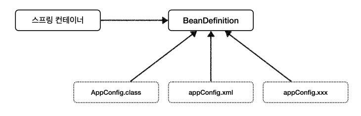

# 스프링 컨테이너 생성
- 스프링 컨테이너가 생성되는 과정을 알아보자. 
```java
//스프링 컨테이너 생성
ApplicationContext applicationContext =
 new AnnotationConfigApplicationContext(AppConfig.class); 
 ```
- ApplicationContext 를 스프링 컨테이너라 한다.
- ApplicationContext 는 인터페이스이다.
- 스프링 컨테이너는 XML을 기반으로 만들 수 있고, 애노테이션 기반의 자바 설정 클래스로 만들 수 있다.
- 직전에 AppConfig 를 사용했던 방식이 애노테이션 기반의 자바 설정 클래스로 스프링 컨테이너를 만든 것이다.
- 자바 설정 클래스를 기반으로 스프링 컨테이너( ApplicationContext )를 만들어보자.
    - new AnnotationConfigApplicationContext(AppConfig.class);
    - 이 클래스는 ApplicationContext 인터페이스의 구현체이다.


- 참고: 더 정확히는 스프링 컨테이너를 부를 때 `BeanFactory` , `ApplicationContext` 로 구분해서 이야기 한다. 이 부분은 뒤에서 설명하겠다. `BeanFactory` 를 직접 사용하는 경우는 거의 없으므로 일반적으로 `ApplicationContext` 를 스프링 컨테이너라 한다.


## 컨테이너에 등록된 모든 빈 조회
스프링 컨테이너에 실제 스프링 빈들이 잘 등록 되었는지 확인하는방법

```java
public class ApplicationContextInfoTest {

    AnnotationConfigApplicationContext ac = new AnnotationConfigApplicationContext(AppConfig.class);

    @Test
    @DisplayName("모든 빈 출력하기")
    void findAllBean() {
        String[] beanDefinitionNames = ac.getBeanDefinitionNames();
        for (String beanDefinitionName : beanDefinitionNames) {
            Object bean = ac.getBean(beanDefinitionName);
            System.out.println("name = " + beanDefinitionName +" object = " + bean);
        }
    }

    @Test
    @DisplayName("애플리케이션 빈 출력하기")
    void findApplicationBean() {
        String[] beanDefinitionNames = ac.getBeanDefinitionNames();
        for (String beanDefinitionName : beanDefinitionNames) {
            BeanDefinition beanDefinition = ac.getBeanDefinition(beanDefinitionName);

            if (beanDefinition.getRole() == BeanDefinition.ROLE_APPLICATION){
                Object bean = ac.getBean(beanDefinitionName);
                System.out.println("name = " + beanDefinitionName +" object = " + bean);
            }
        }
    }
}
```

### 모든 빈 출력하기
- 실행하면 스프링에 등록된 모든 빈 정보를 출력할 수 있다.
- ac.getBeanDefinitionNames() : 스프링에 등록된 모든 빈 이름을 조회한다.
- ac.getBean() : 빈 이름으로 빈 객체(인스턴스)를 조회한다.

### 애플리케이션 빈 출력하기
- 스프링이 내부에서 사용하는 빈은 제외하고, 내가 등록한 빈만 출력해보자.
- 스프링이 내부에서 사용하는 빈은 getRole() 로 구분할 수 있다.
- ROLE_APPLICATION : 일반적으로 사용자가 정의한 빈
- ROLE_INFRASTRUCTURE : 스프링이 내부에서 사용하는 빈


## 스프링 빈 조회 - 상속 관계
- 부모 타입으로 조회하면, 자식 타입도 함께 조회한다.
- 그래서 모든 자바 객체의 최고 부모인 `Object 타입`으로 조회하면, 모든 스프링 빈을 조회한다.


## BeanFactory
- 스프링 컨테이너의 최상위 인터페이스다.
- 스프링 빈을 관리하고 조회하는 역할을 담당한다.
- getBean() 을 제공한다.
- 지금까지 우리가 사용했던 대부분의 기능은 BeanFactory가 제공하는 기능이다

## ApplicationContext
-BeanFactory 기능을 모두 상속받아서 제공한다.
-빈을 관리하고 검색하는 기능을 BeanFactory가 제공해


### BeanFactory, ApplicationContext 그러면 둘의 차이가 뭘까?
-애플리케이션을 개발할 때는 빈을 관리하고 조회하는 기능은 물론이고, 수 많은 부가기능이 필요하다.

### ApplicatonContext가 제공하는 부가기능


- 메시지소스를 활용한 국제화 기능
    - 예를 들어서 한국에서 들어오면 한국어로, 영어권에서 들어오면 영어로 출력
- 환경변수
    - 로컬, 개발, 운영등을 구분해서 처리
- 애플리케이션 이벤트
    - 이벤트를 발행하고 구독하는 모델을 편리하게 지원
- 편리한 리소스 조회
    - 파일, 클래스패스, 외부 등에서 리소스를 편리하게 조회

정리
- ApplicationContext는 BeanFactory의 기능을 상속받는다.
- ApplicationContext는 빈 관리기능 + 편리한 부가 기능을 제공한다.
- BeanFactory를 직접 사용할 일은 거의 없다. 부가기능이 포함된
- ApplicationContext를 사용한다.
- BeanFactory나 ApplicationContext를 스프링 컨테이너라 한다


## 다양한 설정 형식 지원 - 자바 코드, XML
- 스프링 컨테이너는 다양한 형식의 설정 정보를 받아들일 수 있게 유연하게 설계되어 있다.
- 자바 코드, XML, Groovy 등등


- xml 기반으로 설정하는 것은 최근에 잘 사용하지 않으므로 필요하면 스프링 공식 레퍼런스 문서 체크
- 


## 스프링 빈 설정 메타 정보 - BeanDefinition
- 스프링은 어떻게 이런 다양한 설정 형식을 지원하는 것일까? 
    - 그 중심에는 BeanDefinition 이라는 추상화가 있다.
- 쉽게 이야기해서 `역할과 구현을 개념적으로 나눈 것`이다!
    - XML을 읽어서 BeanDefinition을 만들면 된다.
    - 자바 코드를 읽어서 BeanDefinition을 만들면 된다.
    - 스프링 컨테이너는 자바 코드인지, XML인지 몰라도 된다. 오직 BeanDefinition만 알면 된다.
- `BeanDefinition` 을 빈 설정 메타정보라 한다.
    - `@Bean` , `<bean>` 당 각각 하나씩 메타 정보가 생성된다.
- 스프링 컨테이너는 이 메타정보를 기반으로 스프링 빈을 생성한다.




- 우리가 일반적으로 등록하는건 팩토리빈을 통해서 등록하는것임.
