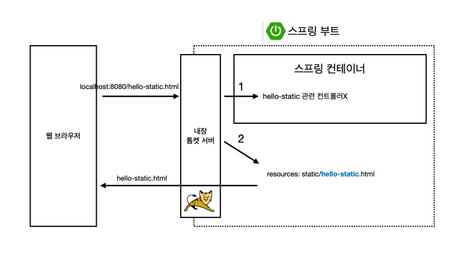
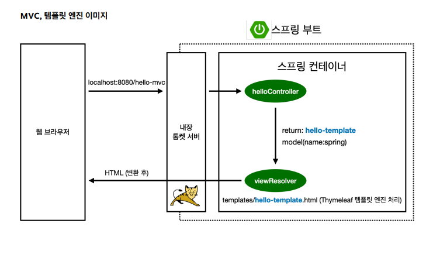

## 

- 1. hello-static.html을 톰캣에 넘기면 >
- 2. 스프링 컨테이너에서 hello-static 관련 컨트롤러를 찾음
- 3. resources: static/hello-static.html 이 있으면 바로 불러오는 방식
- 4. 이후 값을 웹 브라우저에 넘겨줌.

## MVC와 템플릿 엔진
- MVC: Model, View, Controller

- VIEW는 화면과 관련된 일만
- CONTROLLER은 비즈니스 로직만 진행

### 템플릿 엔진 작동 원리

- 1. 내장 톰켓서버를 통해서 hello-mvc를 체크하고
- 2. hellocontroller가
    - return: hello-template를 체크하고
    - model(name:spring)을 넘겨줌
- 3. viewResolver: view를 찾아서 템플릿 엔진을 처리해줌.
    - templates/hello-template.html 을 찾아서 Thymeleaf엔진에 넘기고
    - 타임리프 엔진이 HTML 변환 한 후 넘겨주게됨.
        - 정적 페이지가 아니기에 변환을 한 후 넘겨줌

## ResponseBody 사용 원리
- 객체를 반환해줌.
- HttpMessageConver를 통해서 view없이 그냥 바로 Response에다가 딱 넣어서 던져줌.

- @ResponseBody 어노테이션이 있으면, hello 객체를 넘긴 부분을
    - HttpMessageConverter가 동작한 후 
    - 단순 문자면 String converter가 동작
    - 객체면 JsonConverter가 동작함
        - 이미지는 Jackson이라는 라이브러리가 JSON으로 바꿔줄것임.
    - 변경된 값을 JSON으로 바꾸고 웹 브라우저에 던져줌. 
        - 해당값들을 HTTP 바디에 보내주게되는것임!
            - {name:spring} 과 같은 방식의 JSON 타입으로 던져주게 되는것.

- 실제 실무에서도 그대로 사용하기 때문에 걱정x

