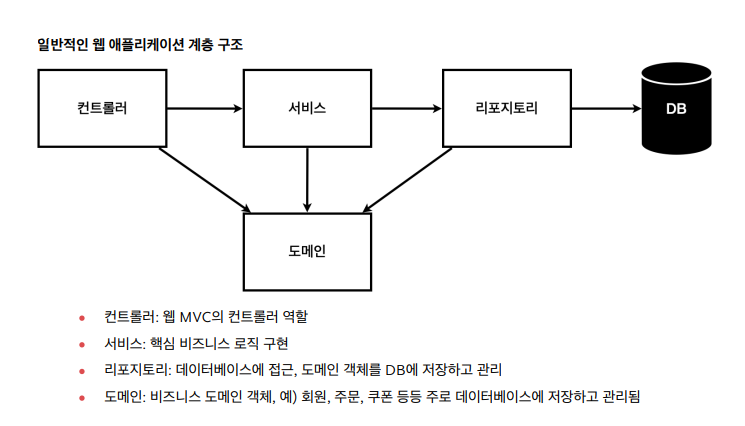

## 


### AfterEach 어노테이션
```java
    @AfterEach // 각 메서드 실행이 끝날때마다 실행되게 하는 어노테이션
    public void afterEach(){
        repository.clearStore(); // 레포지토리를 싹 지워주는 것임.
    }
```


## 테스트 케이스 작성법
- given / when / then으로 일반적으로 작성된다.

- 예시
```java

    // 테스트명은 과감하게 한국어로 적어도 됨.
    // 테스트는 정상 테스트도 중요하지만 예외테스트가 더 중요함.
    @Test
    void 회원가입() {
        //given
        Member member = new Member();
        member.setName("hello");

        //when
        Long saveId = memberService.join(member);

        //then
        Member findMember = memberService.findOne(saveId).get();
        assertThat(member.getName()).isEqualTo(findMember.getName());
        
    }
```

### `@BeforeEach` 어노테이션 
- 각 테스트 실행 전에 호출된다. 테스트가 서로 영향이 없도록 항상 새로운 객체를 생성하고, 의존관계도 새로 맺어준다.Kw