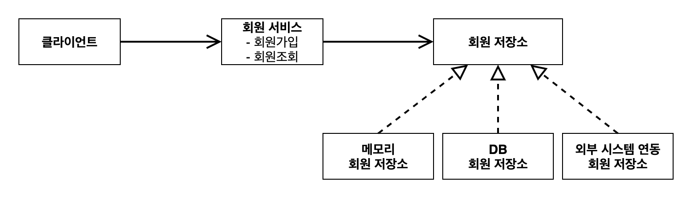
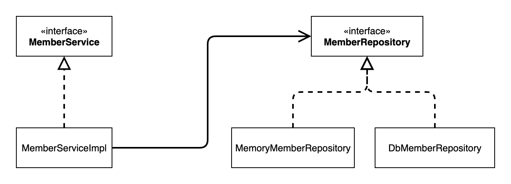
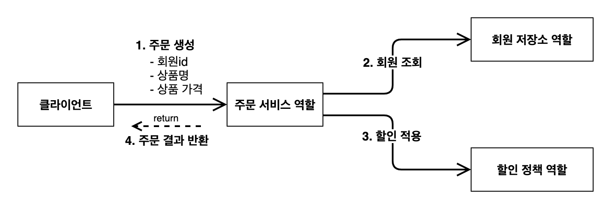
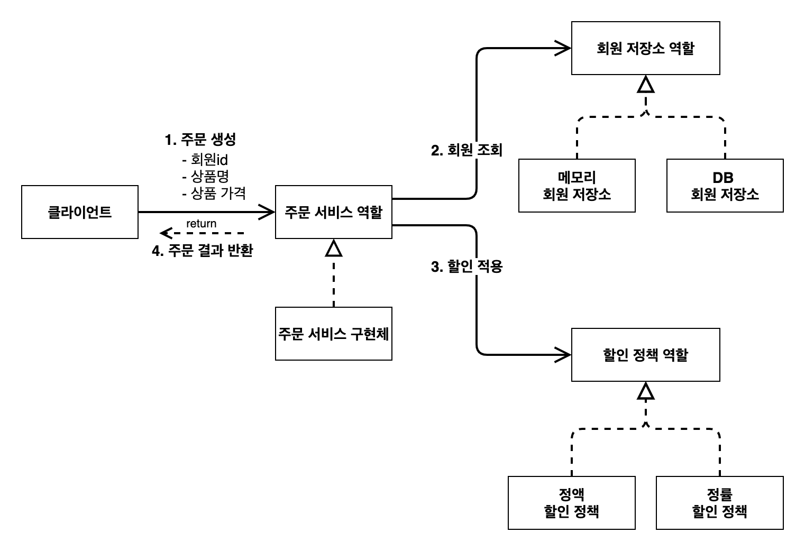
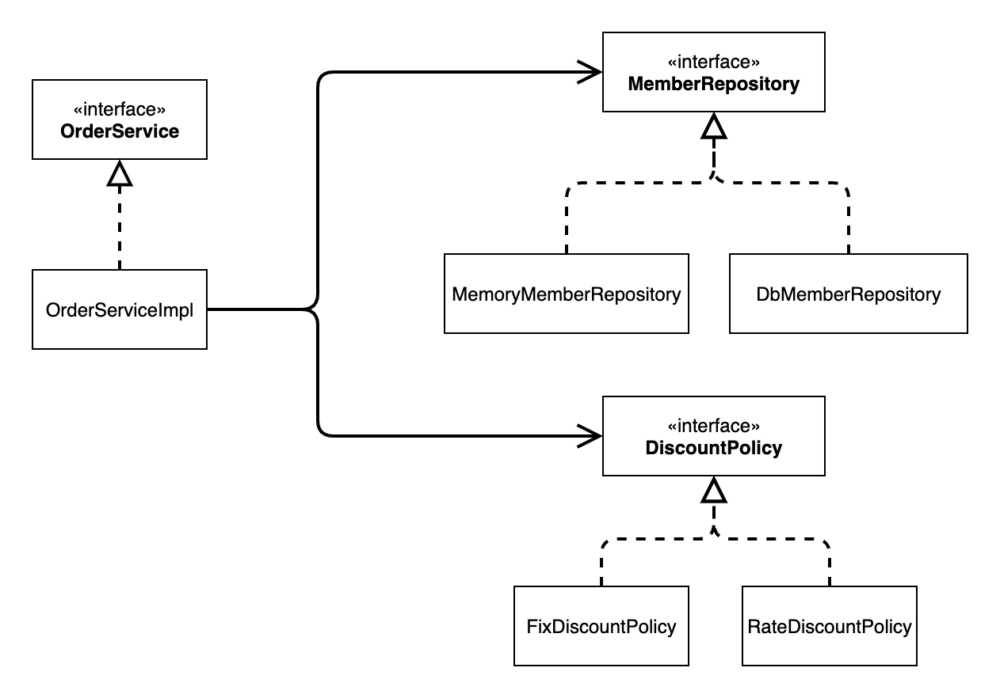
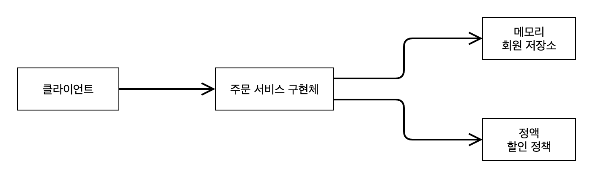
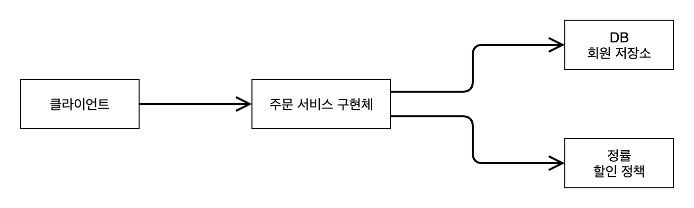

# 2. 스프링 핵심 원리 이해1 - 예제 만들기

## 프로젝트 생성

**스프링 부트 스타터 사이트로 이동해서 스프링 프로젝트 생성**

- https://start.spring.io
- 프로젝트 선택
  - Project: **Gradle - Groovy** Project
  - Spring Boot: 3.x.x
  - Language: Java
  - Packaging: Jar
  - Java: 17 또는 21
- Project Metadata
  - groupId: hello
  - artifactId: core
- Dependencies: 선택하지 않는다.

### Gradle 전체 설정

스프링 부트 스타터가 생성한 프로젝트 내 `build.gradle` 확인

- 동작 확인
  - 기본 메인 클래스 실행(`CoreApplication.main()`)하여 빌드

### Gradle - Build and run using 옵션

**주의! 스프링 부트 3.2 부터 Gradle 옵션을 선택하자.**

- 스프링 부트 3.2 부터 IntelliJ IDEA 선택 시 오류 발생
- **Gradle을 선택하기**

## 비즈니스 요구사항과 설계

- **회원**
  - 회원을 가입하고 조회할 수 있다.
  - 회원은 일반과 VIP 두 가지 등급이 있다.
  - 회원 데이터는 자체 DB를 구축할 수 있고, 외부 시스템과 연동할 수 있다. (미확정)
- **주문과 할인 정책**
  - 회원은 상품을 주문할 수 있다.
  - 회원 등급에 따라 할인 정책을 적용할 수 있다.
  - 할인 정책은 모든 VIP는 1000원을 할인해주는 고정 금액 할인을 적용해달라.(나중에 변경 될 수 있다.)
  - 할인 정책은 변경 가능성이 높다. 회사의 기본 할인 정책을 아직 정하지 못했고, 오픈 직전까지 고민을 미루고 싶다. 최악의 경우 할인을 적용하지 않을 수 도 있다. (미확정)

---

- 요구사항 중 회원 데이터, 할인 정책 같은 부분은 지금 결정하기 어려운 부분
- 그러나 정책이 결정될 때까지 개발을 무기한 기다릴 수도 없다.
  - 인터페이스를 만들고 구현체를 언제든지 갈아끼울 수 있도록 설계(역할과 구현 구분하기)

## 회원 도메인 설계

### 회원 도메인 요구사항

- 회원을 가입하고 조회할 수 있다.
- 회원은 일반과 VIP 두 가지 등급이 있다.
- 회원 데이터는 자체 DB를 구축할 수 있고, 외부 시스템과 연동할 수 있다. (미확정)

**회원 도메인 협력 관계**


- 클라이언트가 회원 서비스 호출
- 서비스는 두가지 기능 제공
- 회원 데이터에 접근하는 계층 따로 생성(회원 데이터는 미확정이기 때문에) - 일단 메모리 회원 저장소라는 정말 간단한 저장소 만들어서 개발 시작(only 개발용) 
  - 추후 구현체 선택
  
**회원 클래스 다이어그램**


**회원 객체 다이어그램**

- 회원 서비스: **MemberServiceImpl**(실제 참조하는 인스턴스는 `MemberServiceImpl`)

---

- 클래스 다이어그램은 실제 서버 실행 시에 대한 정보가 아닌, 오직 클래스만!
- 클래스 다이어그램만으로는 동적으로 결정되는 것들에 대해서 판단하기 어려움
- 객체 다이어그램 통해 실제 서버에서 클라이언트가 사용하는(참조하는) 객체 나타냄

## 회원 도메인 개발

### 회원 엔티티

**회원 등급**

```java
package hello.core.member;

public enum Grade {
    BASIC,  // 일반회원
    VIP     // VIP 회원
}
```

**회원 엔티티**

```java
package hello.core.member;

public class Member {
    private long id;
    private String name;
    private Grade grade;

    /*
    생성자와 getter, setter
    */
}
```

### 회원 저장소

**회원 저장소 인터페이스**

```java
package hello.core.member;

public interface MemberRepository {
    void save(Member member);       // 회원 저장
    Member findById(Long memberId); // 회원 조회
}
```

**회원 저장소 구현체**

```java
package hello.core.member;

import java.util.HashMap;
import java.util.Map;

public class MemoryMemberRepository implements MemberRepository {

    private static Map<Long, Member> store = new HashMap<>();
    // 저장소니까 Map 사용했다. 원래는 동시성 이슈때매 concurrenthashmap 사용해야 하지만, 예제니까 일단 Map으로 구현함.

    @Override
    public void save(Member member) {
        store.put(member.getId(), member);      // store라는 Map에 put 메서드 실행(Member.getId()라는 키에 대한 member라는 값)
    }

    @Override
    public Member findById(Long memberId) {
        return store.get(memberId);             // store라는 Map에 get 메서드 실행한 결과 반환(memberId를 키로 하는 값 찾기)
    }
}
```
- DB가 확정되지 않았으니 우선 간단하게 메모리 회원 저장소 구현해서 개발을 진행.
- 예제 코드에서는 HashMap 사용했으나, 동시성 이슈가 발생할 수 있다. 따라서 실제 개발 시 ConcurrentHashMap 사용하자.

### 회원 서비스

**회원 서비스 인터페이스**

```java
package hello.core.member;

public interface MemberService {
    void join(Member member);           // 회원가입
    Member findMember(Long memberId);   // 회원조회
}
```

**회원 서비스 구현체**

```java
package hello.core.member;

public class MemberServiceImpl implements MemberService {

    // 인터페이스만 있으면 NullPointException 발생할 수 있음!!
    // 구현 객체 선택해야 한다.
    private final MemberRepository memberRepository = new MemoryMemberRepository();

    @Override
    public void join(Member member) {
        memberRepository.save(member);
    }

    @Override
    public Member findMember(Long memberId) {
        return memberRepository.findById(memberId);
    }
}
```

## 회원 도메인 실행과 테스트

- main 메서드를 사용하거나 JUnit 테스트를 사용하는 두 가지 방법이 있다.
- 하지만 애플리케이션 로직(main 메서드)으로 테스트 하는 방법은 좋은 방법이 아니다!!
- 따라서 JUnit 테스트를 사용

```java
package hello.core.member;

import org.assertj.core.api.Assertions;
import org.junit.jupiter.api.Test;

public class MemberServiceTest {
    MemberService memberService = new MemberServiceImpl();

    @Test
    void join() {
        // given
        Member member = new Member(1L, "memberA", Grade.VIP);   // 회원 생성

        // when
        memberService.join(member);                                         // 회원가입
        Member findMember = memberService.findMember(1L);           // 회원 조회

        // then
        Assertions.assertThat(member).isEqualTo(findMember);                // 생성한 회원과 조회한 회원이 같은지?
    }
}
```

### 회원 도메인 설계의 문제점

- 테스트는 통과했으나 **의존관계가 인터페이스 뿐만 아니라 구현까지 모두 의존하는 문제점이 있음**
  ```java
  public class MemberServiceImpl implements MemberService {
      private final MemberRepository memberRepository = new MemoryMemberRepository();
      ...
  }
  ```
  - 따라서 다른 저장소로 변경 시 OCP, DIP 원칙에 위배될 수 있다.

## 주문과 할인 도메인 설계

- 주문과 할인 정책
- 회원은 상품을 주문할 수 있다.
- 회원 등급에 따라 할인 정책을 적용할 수 있다.
- 할인 정책은 모든 VIP는 1000원을 할인해주는 고정 금액 할인을 적용해달라. (나중에 변경 될 수 있다.)
- 할인 정책은 변경 가능성이 높다. 회사의 기본 할인 정책을 아직 정하지 못했고 오픈 직전까지 고민을 미루고 싶다. 
  - 최악의 경우 할인을 적용하지 않을 수 도 있다. (미확정)

**주문 도메인 협력, 역할, 책임**

1. **주문 생성:** 클라이언트는 주문 서비스에 주문 생성을 요청한다.
2. **회원 조회:** 할인을 위해서는 회원 등급이 필요하다. 그래서 주문 서비스는 회원 저장소에서 회원을 조회한다.
3. **할인 적용:** 주문 서비스는 회원 등급에 따른 할인 여부를 할인 정책에 위임한다.
4. **주문 결과 반환:** 주문 서비스는 할인 결과를 포함한 주문 결과를 반환한다.

> 참고: 실제로는 주문 데이터를 DB에 저장, 예제에서는 단순히 주문 결과를 반환한다.

**주문 도메인 전체**


- **역할과 구현을 분리**해서 자유롭게 구현 객체를 조립할 수 있게 설계했다. 
- 회원 저장소는 물론이고, 할인 정책도 유연하게 변경할 수 있다.

**주문 도메인 클래스 다이어그램**


**주문 도메인 객체 다이어그램1**


**주문 도메인 객체 다이어그램2**


- DB 구현체와 할인 정책을 변경해도 주문 서비스를 변경할 필요가 없다.
- 협력 관계를 그대로 재사용 할 수 있다.

## 주문과 할인 도메인 개발

**주문 엔티티**

```java
package hello.core.order;

public class Order {
    private Long memberId;
    private String itemName;
    private int itemPrice;
    private int discountPrice;

    /*
    생성자와 getter, setter
    */

    // 할인된 가격 계산
    public int calculatePrice() {
        return itemPrice - discountPrice;
    }

    // Order 객체 출력하기
    @Override
    public String toString() {
        return "Order{" +
                "memberId=" + memberId +
                ", itemName='" + itemName + '\'' +
                ", itemPrice=" + itemPrice +
                ", discountPrice=" + discountPrice +
                '}';
    }
}
```

**주문 서비스 인터페이스**

```java
package hello.core.order;

public interface OrderService {
    Order createOrder(Long memberId, String itemName, int itemPrice);
}
```

**주문 서비스 구현체**

```java
package hello.core.order;

import hello.core.discount.DiscountPolicy;
import hello.core.discount.FixDiscoutPolicy;
import hello.core.member.Member;
import hello.core.member.MemberRepository;
import hello.core.member.MemberService;
import hello.core.member.MemoryMemberRepository;

public class OrderServiceImpl implements OrderService {

    private final MemberRepository memberRepository = new MemoryMemberRepository();
    private final DiscountPolicy discountPolicy = new FixDiscoutPolicy();

    @Override
    public Order createOrder(Long memberId, String itemName, int itemPrice) {
        Member member = memberRepository.findById(memberId);
        int discountPrice = discountPolicy.discount(member, itemPrice);

        return new Order(memberId, itemName, itemPrice, discountPrice);
    }
}
```

**할인 정책 인터페이스**

```java
package hello.core.discount;

import hello.core.member.Member;

public interface DiscountPolicy {

    /**
     * @return  할인 대상 금액
     */

    int discount(Member member, int price);
}
```

**정액 할인 정책 구현체**

```java
package hello.core.discount;

import hello.core.member.Grade;
import hello.core.member.Member;

public class FixDiscoutPolicy implements DiscountPolicy {

    private int discountFixAmount = 1000;   // 1000원 할인

    @Override
    public int discount(Member member, int price) {
        if (member.getGrade() == Grade.VIP) {
            return discountFixAmount;
        } else {
            return 0;
        }
    }
}
```

## 주문과 할인 도메인 실행과 테스트

```java
package hello.core.order;

import hello.core.member.Grade;
import hello.core.member.Member;
import hello.core.member.MemberService;
import hello.core.member.MemberServiceImpl;
import org.assertj.core.api.Assertions;
import org.junit.jupiter.api.Test;

public class OrderServiceTest {

    MemberService memberService = new MemberServiceImpl();
    OrderService orderService = new OrderServiceImpl();

    @Test
    void createOrder() {
        Long memberId = 1L;
        Member member = new Member(memberId, "memberA", Grade.VIP);
        memberService.join(member);

        Order order = orderService.createOrder(memberId, "itemA", 10000);
        Assertions.assertThat(order.getDiscountPrice()).isEqualTo(1000);
    }
}
```