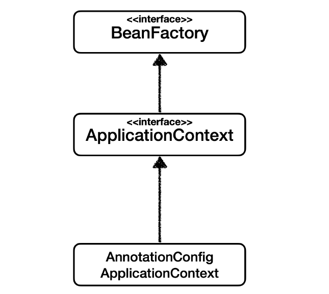

# 스프링 컨테이너와 스프링 빈
## 스프링 컨테이너 생성
```java
ApplicationContext applicationContext = new AnnotationConfigApplicationContext(AppConfig.class);
```
- `ApplicationContext` 를 스프링 컨테이너라 한다.
- 생성자의 파라미터로 appconfig 넘기면 applicationContext 반환
- 다형성 적용돼있음 (`ApplicationContext`는 인터페이스, 이를 구현한 것이 `AnnotationConfigApplicationContext`)
- 스프링 컨테이너는 XML을 기반으로 만들 수 있고, 애노테이션 기반의 자바 설정 클래스로 만들 수 있다.
- 직전에 `AppConfig` 를 사용했던 방식이 애노테이션 기반의 자바 설정 클래스로 스프링 컨테이너를 만든 것이다.

> 참고: 더 정확히는 스프링 컨테이너를 부를 때 `BeanFactory` , `ApplicationContext` 로 구분해서 이야기한다. `BeanFactory` 를 직접 사용하는 경우는 거의 없으므로 일반적으로 `ApplicationContext` 를 스프링 컨테이너라 한다.


### 스프링 컨테이너의 생성 과정
**1. 스프링 컨테이너 생성**


- `new AnnotationConfigApplicationContext(AppConfig.class)`
- 스프링 컨테이너를 생성할 때는 구성 정보(여기선 `AppConfig.class`)를 지정해주어야 한다.
- key: 빈 이름, value: 빈 객체 형태로 스프링 빈 저장소에 저장

**2. 스프링 빈 등록**


- 스프링 컨테이너는 파라미터로 넘어온 설정 클래스 정보를 사용해서 스프링 빈을 등록한다.
- 빈 이름은 메서드 이름을 사용한다.
- 빈 이름을 직접 부여할 수 도 있다.
    - `@Bean(name="memberService2")`
> **주의: 빈 이름은 항상 다른 이름을 부여**해야 한다. 같은 이름을 부여하면, 다른 빈이 무시되거나, 기존 빈을 덮어버
리거나 설정에 따라 오류가 발생한다.

**3. 스프링 빈 의존관계 설정**


- 스프링 컨테이너는 설정 정보를 참고해서 의존관계를 주입(DI)한다.
- 단순히 자바 코드를 호출하는 것 같지만, 차이가 있다. 이 차이는 뒤에 싱글톤 컨테이너에서 설명한다
> **참고**
스프링은 빈을 생성하고, 의존관계를 주입하는 단계가 나누어져 있다. 그런데 이렇게 자바 코드로 스프링 빈을 등록하면
생성자를 호출하면서 의존관계 주입도 한번에 처리된다. 여기서는 이해를 돕기 위해 개념적으로 나누어 설명했다.


## 컨테이너에 등록된 모든 빈 조회
```java
public class ApplicationContextInfoTest {

    AnnotationConfigApplicationContext ac = new AnnotationConfigApplicationContext(AppConfig.class);

    @Test
    @DisplayName("모든 빈 출력하기")
    void findAllBean() {
        String[] beanDefinitionNames = ac.getBeanDefinitionNames();
        for (String beanDefinitaionName : beanDefinitionNames) {
            Object bean = ac.getBean(beanDefinitaionName);
            System.out.println("name = " + beanDefinitaionName+" object = " + bean);
        }
    }

    @Test
    @DisplayName("애플리케이션 빈 출력하기")
    void findApplicationBean() {
        String[] beanDefinitionNames = ac.getBeanDefinitionNames();
        for (String beanDefinitaionName : beanDefinitionNames) {
            BeanDefinition beanDefinition = ac.getBeanDefinition(beanDefinitaionName);

            if (beanDefinition.getRole() == BeanDefinition.ROLE_APPLICATION) {
                Object bean = ac.getBean(beanDefinitaionName);
                System.out.println("name = " + beanDefinitaionName + " object = " + bean);
            }
        }
    }

    @Test
    @DisplayName("스프링 내부 빈 출력하기")
    void findInfrastructureBean() {
        String[] beanDefinitionNames = ac.getBeanDefinitionNames();
        for (String beanDefinitaionName : beanDefinitionNames) {
            BeanDefinition beanDefinition = ac.getBeanDefinition(beanDefinitaionName);

            if (beanDefinition.getRole() == BeanDefinition.ROLE_INFRASTRUCTURE) {
                Object bean = ac.getBean(beanDefinitaionName);
                System.out.println("name = " + beanDefinitaionName + " object = " + bean);
            }
        }
    }
}
```
**모든 빈 출력하기**
- 실행하면 스프링에 등록된 모든 빈 정보를 출력할 수 있다.
- `ac.getBeanDefinitionNames()` : 스프링에 등록된 모든 빈 이름을 조회한다.
- `ac.getBean()` : 빈 이름으로 빈 객체(인스턴스)를 조회한다.
 
**애플리케이션 빈 혹은 스프링 내부 빈만 출력하기**
- 스프링이 내부에서 사용하는 빈은 `getRole()` 로 구분할 수 있다.
- `ROLE_APPLICATION` : 일반적으로 사용자가 정의한 빈
- `ROLE_INFRASTRUCTURE` : 스프링이 내부에서 사용하는 빈

## 스프링 빈 조회
> 스프링 컨테이너에서 스프링 빈을 찾는 가장 기본적인 조회 방법
- `ac.getBean(빈이름, 타입)`
- `ac.getBean(타입)`
  - 사용 시 인자로 `Object.class`와 같이 `클래스.class` 형태로 넣어줄 것.
- 조회 대상 스프링 빈이 없으면 예외 발생
  - `NoSuchBeanDefinitionException: No bean named 'xxxxx' available`
> 참고: 구체 타입으로 조회하면 변경 시 유연성이 떨어진다.

### 동일한 타입이 둘 이상
- 타입으로 조회시 같은 타입의 스프링 빈이 둘 이상이면 오류가 발생한다. 이때는 빈 이름을 지정하자.
- `ac.getBeansOfType()` 을 사용하면 해당 타입의 모든 빈을 조회할 수 있다.
  - 사용 시 인자로 `Object.class`와 같이 `클래스.class` 형태로 넣어줄 것.

### 상속 관계
- 부모 타입으로 조회하면, 자식 타입도 함께 조회한다.
- 그래서 모든 자바 객체의 최고 부모인 `Object` 타입으로 조회하면, 모든 스프링 빈을 조회한다.


## BeanFactory와 ApplicationContext

### **Bean Factory**
- 스프링 컨테이너의 최상위 인터페이스
- 스프링 빈 관리 및 조회 역할
- `getBean()` 메서드 제공
- 우리가 사용한 대부부의 기능은 Bean Factory가 제공
### **ApplicationContext**
- 빈 팩토리 기능을 모두 상속받아 제공
- 빈팩토리와 차이점?
- 애플리케이션 관리에 필요한 수많은 부가기능 제공
### **ApplicatonContext가 제공하는 부가기능**

- **메시지소스를 활용한 국제화 기능**
  - 예를 들어서 한국에서 들어오면 한국어로, 영어권에서 들어오면 영어로 출력
- **환경변수**
  - 로컬, 개발, 운영등을 구분해서 처리
- **애플리케이션 이벤트**
  - 이벤트를 발행하고 구독하는 모델을 편리하게 지원
- **편리한 리소스 조회**
  - 파일, 클래스패스, 외부 등에서 리소스를 편리하게 조회

**정리**
- ApplicationContext는 BeanFactory의 기능을 상속받는다.
- ApplicationContext는 빈 관리기능 + 편리한 부가 기능을 제공한다.
- BeanFactory를 직접 사용할 일은 거의 없다. 부가기능이 포함된 ApplicationContext를 사용한다.
- BeanFactory나 ApplicationContext를 스프링 컨테이너라 한다.

## 다양한 설정 형식 지원 - 자바 코드, XML
**스프링 컨테이너는 다양한 형식(자바 코드, xml, Groovy 등등)의 설정 정보를 받아들일 수 있게 유연하게 설계되어 있다.**
### 애노테이션 기반 자바 코드 설정 사용
- 지금까지 했던 것
- `new AnnotationConfigApplicationContext(AppConfig.class)`
- `AnnotationConfigApplicationContext` 클래스를 사용하면서 자바 코드로된 설정 정보를 넘기면 된다.
### XML 설정 사용
- 최근에는 스프링 부트를 많이 사용하면서 XML기반의 설정은 잘 사용하지 않는다. 
- 아직 많은 레거시 프로젝트들이 XML로 되어 있고, 또 XML을 사용하면 컴파일 없이 빈 설정 정보를 변경할 수 있는 장점도 있으므로 한번쯤 배워두는 것도 괜찮다.
- XML 사용 시 `AnnotationConfigApplicationContext`이 아닌 `GenericXmlApplicationContext` 를 사용
  
```xml
<?xml version="1.0" encoding="UTF-8"?>
<beans xmlns="http://www.springframework.org/schema/beans"
       xmlns:xsi="http://www.w3.org/2001/XMLSchema-instance"
       xsi:schemaLocation="http://www.springframework.org/schema/beans http://www.springframework.org/schema/beans/spring-beans.xsd">
    <!-- 여기에 빈 등록! -->
</beans>
```
> xml 기반으로 설정하는 것은 최근에 잘 사용하지 않으므로 간단히 넘어가자.


## 스프링 빈 설정 메타 정보
### BeanDefinition
- 스프링이 XML, Java(어노테이션) 등 다양한 설정 형식을 지원할 수 있는 이유
- 빈 정보에 대한 것들을 추상화 시킨 것
- XML / 자바 코드를 읽어서 BeanDefinition을 만들면 됨
- `BeanDefinition`은 빈 설정 메타정보
  - `@Bean`, `<bean>` 당 각각 하나씩 메타 정보가 생성됨
  - `getBeanDefinition()` 메서드 통해 빈의 메타정보 확인할 수 있다.
- 스프링 컨테이너는 이 메타정보를 기반으로 스프링 빈을 생성한다.
  - XML인지 자바코드인지는 몰라도 된다
  - 스프링 컨테이너는 BeanDefinition만 의존


- XML: 스프링 빈을 직접 등록
- Annotation: 팩토리 메서드 통해 우회하여 등록


- AnnotationConfigApplicationContext` 는 `AnnotatedBeanDefinitionReader` 를 사용해서 `AppConfig.class` 를 읽고 `BeanDefinition` 을 생성한다.
- `GenericXmlApplicationContext` 는 `XmlBeanDefinitionReader` 를 사용해서 `appConfig.xml` 설정 정보를 읽고 `BeanDefinition` 을 생성한다.
- 새로운 형식의 설정 정보가 추가되면, XxxBeanDefinitionReader를 만들어서 `BeanDefinition` 을 생성하면 된다.


### BeanDefinition 살펴보기
**BeanDefinition 정보**
- BeanClassName: 생성할 빈의 클래스 명(자바 설정 처럼 팩토리 역할의 빈을 사용하면 없음)
- factoryBeanName: 팩토리 역할의 빈을 사용할 경우 이름, 예) appConfig
- factoryMethodName: 빈을 생성할 팩토리 메서드 지정, 예) memberService
- Scope: 싱글톤(기본값)
- lazyInit: 스프링 컨테이너를 생성할 때 빈을 생성하는 것이 아니라, 실제 빈을 사용할 때 까지 최대한 생성을 지연처리 하는지 여부
- InitMethodName: 빈을 생성하고, 의존관계를 적용한 뒤에 호출되는 초기화 메서드 명
- DestroyMethodName: 빈의 생명주기가 끝나서 제거하기 직전에 호출되는 메서드 명
- Constructor arguments, Properties: 의존관계 주입에서 사용한다. (자바 설정 처럼 팩토리 역할의 빈을 사용하면 없음)

### 메서드 설명
- `getBeanDefinitionNames()`: 빈 이름 반환
- `getBeanDefinition()`: 빈 메타정보 반환
- `getRole()`: ROLE 반환 (ROLE_APPLICATION, ROLE_INFRASTRUCTURE)

**정리**
- BeanDefinition을 직접 생성해서 스프링 컨테이너에 등록할 수 도 있다. 하지만 실무에서 BeanDefinition을 직접 정의하거나 사용할 일은 거의 없다.
- 스프링이 다양한 형태의 설정 정보를 BeanDefinition으로 추상화해서 사용한다는 것이 핵심
- 스프링 코드에서 BeanDefinition을 마주칠 때 이러한 메커니즘을 떠올릴 수 있으면 된다.