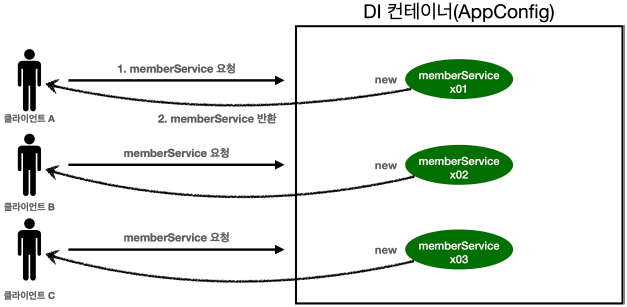
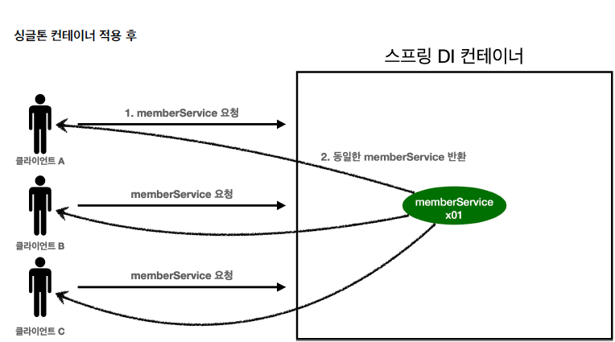
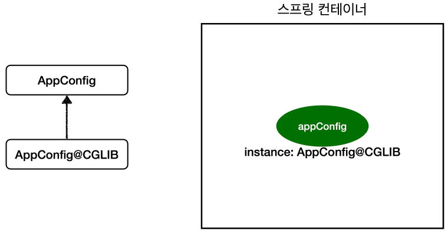

# 5. 싱글톤 컨테이너

## 웹 애플리케이션과 싱글톤
- 스프링은 웹 애플리케이션 개발용
- 웹 애플리케이션은 여러 사용자가 요청을 보낸다.
- DI 컨테이너(AppConfig)에서 요청 시마다 객체 생성하게 되면 메모리 낭비



### 싱글톤 패턴
- 클래스의 인스턴스가 1개만 생성되는 것을 보장하는 디자인 패턴
- 객체 인스턴스를 2개 이상 생성하지 못하도록 막는다.
```java

//1. static 영역에 객체를 딱 1개만 생성해둔다.
private static final SingletonService instance = new SingletonService();

//2. public으로 열어서 객체 인스턴스가 필요하면 이 static 메서드를 통해서만 조회하도록 허용한
다.
public static SingletonService getInstance() {
    return instance;
}

//3. 생성자를 private으로 선언해서 외부에서 new 키워드를 사용한 객체 생성을 못하게 막는다.
private SingletonService() {}
```
1. static 영역에 객체 instance를 미리 하나 생성해서 올려둔다.
2. 이 객체 인스턴스가 필요하면 오직 `getInstance()` 메서드를 통해서만 조회할 수 있다. 이 메서드를 호출하면 항상 같은 인스턴스를 반환한다.
3. 딱 1개의 객체 인스턴스만 존재해야 하므로, 생성자를 private으로 막아서 혹시라도 외부에서 new 키워드로 객체 인스턴스가 생성되는 것을 막는다.

- **이제 호출할 때마다 같은 객체 인스턴스를 반환하는 것을 확인할 수 있다.**
> **참고**: 싱글톤 패턴을 구현하는 방법은 아주 다양하다. 여기서는 객체를 미리 생성해두는 가장 단순하고 안전한 방법을 선택했다.

**싱글톤 패턴의 문제점**
- 싱글톤 패턴을 구현하는 코드 자체가 많이 들어간다.
- 의존관계상 클라이언트가 구체 클래스에 의존한다. 
  - 객체 조회 시 `구체클래스.getInstance()` 이용해 조회해야 함
  - DIP를 위반한다.
  - OCP 원칙을 위반할 가능성이 높다.
- 싱글톤은 객체를 미리 생성해버린다.
  - 테스트하기 어렵다.
  - 내부 속성을 변경하거나 초기화 하기 어렵다.
  - private 생성자로 자식 클래스를 만들기 어렵다.
  - 결론적으로 유연성이 떨어진다(DI 적용하기 어렵다).
- 안티패턴으로 불리기도 한다.


## 싱글톤 컨테이너
- 스프링 컨테이너를 쓰면 싱글톤 패턴의 문제점을 해결하면서 자동으로 싱글톤으로 관리해준다.
  - 스프링 컨테이너는 싱글턴 패턴을 적용하지 않아도, 객체 인스턴스를 하나만 생성해서 관리한다.
  - 스프링 컨테이너는 싱글톤 컨테이너 역할을 한다. 이렇게 싱글톤 객체를 생성하고 관리하는 기능을 **싱글톤 레지스트리**라 한다.
  - 싱글톤 패턴을 위한 지저분한 코드가 들어가지 않아도 된다.
  - DIP, OCP, 테스트, private 생성자로 부터 자유롭게 싱글톤을 사용할 수 있다.



스프링 컨테이너 덕분에 고객의 요청이 올 때 마다 객체를 생성하는 것이 아니라, 이미 만들어진 객체를 공유해서
효율적으로 재사용할 수 있다.
> 참고: 스프링의 기본 빈 등록 방식은 싱글톤이지만, 싱글톤 방식만 지원하는 것은 아니다. 요청할 때 마다 새로운 객체를 생성해서 반환하는 기능도 제공한다.\
> (예: http 리퀘스트 혹은 세션 라이프 사이클에 맞춰서 빈 생명주기를 맞추는 용도)

## 싱글톤 방식의 주의점
- 싱글톤과 같이 객체를 공유하는 방식에서는 상태를 유지하게 설계하면 안된다
- **무상태**로 설계
  - 특정 클라이언트에 의존적인 필드가 있으면 안된다.
  - 특정 클라이언트가 값을 변경할 수 있는 필드가 있으면 안된다!
  - 가급적 읽기만 가능하도록 설계(수정X)
  - 필드 대신에 자바에서 공유되지 않는, 지역변수, 파라미터, ThreadLocal 등을 사용해야 한다.
  - 물론 싱글톤빈에서만 !

**예시**
> ThreadA가 사용자A 코드를 호출하고 ThreadB가 사용자B 코드를 호출한다 가정하자.
`StatefulService` 의 `price` 필드는 공유되는 필드인데, 특정 클라이언트가 값을 변경한다.
사용자A의 주문금액은 10000원이 되어야 하는데, 20000원이라는 결과가 나왔다.

> 진짜 공유필드는 조심해야 한다! 스프링 빈은 항상 무상태(stateless)로 설계하자.


## @Configuration과 싱글톤
```java
@Configuration
public class AppConfig {

    @Bean
    public MemberService memberService() {
        return new MemberServiceImpl(memberRepository());
    }

    @Bean
    public OrderService orderService() {
        return new OrderServiceImpl(
            memberRepository(),
            discountPolicy());
    }

    @Bean
    public MemberRepository memberRepository() {
        return new MemoryMemberRepository();
    }
    ...
}
```
- memberService 빈을 만드는 코드를 보면 `memberRepository()` 를 호출한다.
    - 이 메서드를 호출하면 `new MemoryMemberRepository()` 를 호출한다.
- orderService 빈을 만드는 코드도 동일하게 `memberRepository()` 를 호출한다.
    - 이 메서드를 호출하면 `new MemoryMemberRepository()` 를 호출한다.

- 이러면 MemoryMemberRepository 객체를 두번 생성하면서 싱글톤이 깨지는 것 아닌가?

## @Configuration과 바이트코드 조작
스프링은 클래스의 바이트코드를 조작하는 라이브러리를 사용한다.

**`@Configuration`을 적용한 `AppConfig`**



- CGLIB이라는 바이트코드조작 라이브러리가 AppConfig를 상속받은 다른 클래스 하나 만들었음(`AppConfig@CGLIB`)
- 스프링 컨테이너에 등록된 AppConfig는 실제로는 내가 만든 객체가 아니다. 
- `@Bean`이 붙은 메서드마다 이미 스프링 빈이 존재하면 존재하는 빈을 반환하고, 스프링 빈이 없으면 생성해서 스프링 빈으로 등록하고 반환하는 코드가 동적으로 만들어진다.
- 덕분에 싱글톤이 보장되는 것이다.

> **참고** AppConfig@CGLIB는 AppConfig의 자식 타입이므로, AppConfig 타입으로 조회 할 수 있다.


### `@Configuration` 적용하지 않고 `@Bean`만 적용한다면?

- 의존관계 주입이 필요해서 메서드를 직접 호출할 때 생성된 객체는 스프링 빈이 아님. 
- 스프링 컨테이너가 관리해주지 않음. 
- 그냥 `new`(Java 코드) 통해서 객체 생성한 것.
- 싱글톤 깨짐.


**정리**
- @Bean만 사용해도 스프링 빈으로 등록되지만, 싱글톤을 보장하지 않는다.
- `memberRepository()` 처럼 의존관계 주입이 필요해서 메서드를 직접 호출할 때 싱글톤을 보장하지 않는다.
- 크게 고민할 것이 없다. 스프링 설정 정보는 항상 `@Configuration` 을 사용하자.