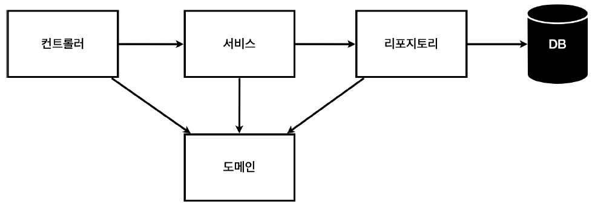
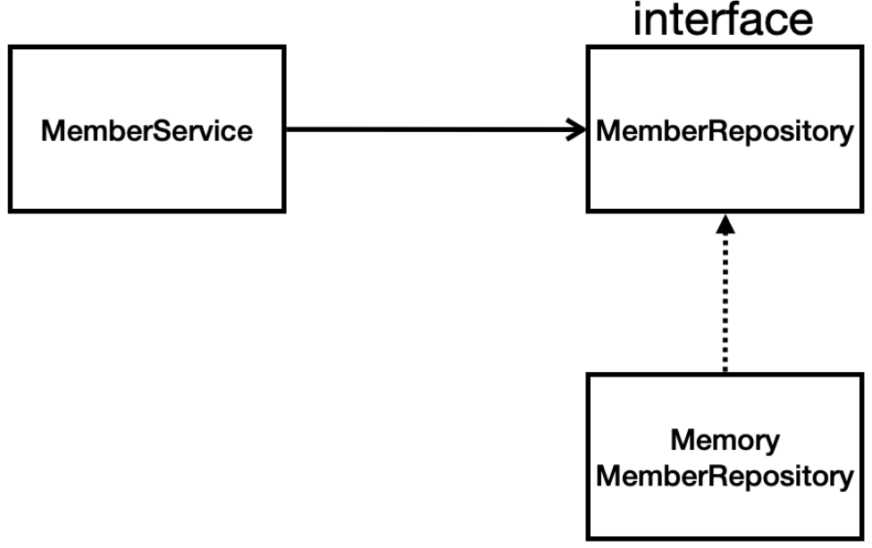

# 회원 관리 예제 - 백엔드 개발
## 비즈니스 요구사항 정리
- 데이터: 회원ID, 이름
- 기능: 회원 등록, 조회
- 아직 데이터 저장소가 선정되지 않음(가상의 시나리오)


**일반적인 웹 애플리케이션 계층 구조**

- 컨트롤러: 웹 MVC의 컨트로럴 역할
- 서비스: 비즈니스 도메인 객체를 가지고 핵심 비즈니스 로직 구현
- 리포지토리: 데이터베이스에 접근, 도메인 객체를 DB에 저장하고 관리
- 도메인: DB에 저장하고 관리되는 비즈니스 도메인 객체(회원, 주문, 쿠폰 등)

**클래스 의존 관계**

- 리포지토리: 아직 데이터 저장소가 선정되지 않았음
    - 추후 구현 클래스 변경할 수 있도록 인터페이스로 설계
- 데이터 저장소는 아직 미정
- 초기 개발 단계에서 구현체로 가벼운 메모리 기반의 데이터 저장소 사용

## 회원 도메인과 리포지토리 만들기
**회원 객체**
```java
package hello.hellospring.domain;

public class Member {

	private Long id;
	private String name;

	public Long getId() {
		return id;
	}

	public void setId(Long id) {
		this.id = id;
	}

	public String getName() {
		return name;
	}

	public void setName(String name) {
		this.name = name;
	}
}
```
- Id: 회원가입 시 입력
- Name: 시스템이 등록해줌(++sequence)

**회원 리포지토리 인터페이스**
```java
package hello.hellospring.repository;

import hello.hellospring.domain.Member;

import java.util.List;
import java.util.Optional;

public interface MemberRepository {

	Member save(Member member);
	Optional<Member> findById(Long id);
	Optional<Member> findByName(String name);
	List<Member> findAll();

}
```

**회원 리포지토리 구현체**
```java
package hello.hello_spring.repository;

import hello.hello_spring.domain.Member;

import java.util.*;

public class MemoryMemberRepository implements MemberRepository {
	
	// 실무에서는 동시성 문제 고려하여 공유되는 변수일 경우  ConcurrentHashMap, AtomicLong 등 사용
	private static Map<Long, Member> store = new HashMap<>();	// id와 회원 매치해주기 위해 Map 사용
	private static long sequence 0L;	// 키 값을 생성
	
	public void clearStore() {
		store.clear();
	}

	@Override
	public Member save(Member member) {
		member.setId(++sequence);
		store.put(member.getId(), member);
		return member;
	}

	@Override
	public Optional<Member> findById(Long id) {
		return Optional.ofNullable(store.get(id));	// ofNullable(): null이어도 문제 없다!!
	}
	
	@Override
	public Optional<Member> findByName(String name) {
		return store.values().stream()	// 반복
				.filter(member -> member.getName().equals(name))	// 람다 사용해서 member.getName()이 name과 같은지 확인
				.findAny();	// 하나 찾으면 반환, 없으면 optional에 null 포함해서 반환
	}
	
	@Override
	public List<Member> findAll() {
		return new ArrayList<>(store.values());	// store에 있는 모든 멤버 반환
	}
}
```

## 회원 리포지토리 테스트 케이스 작성
- 코드를 코드로 검증
- main 메서드를 이용해 동작하는지 확인? → 너무 오래 걸리고 불편함
- JUnit이라는 프레임워크로 테스트 실행
  - `ctrl + shift + T`: 테스트 케이스 생성
  - 테스트 케이스의 기본 형식
  ```java
      @Test
      void 테스트할메서드() {
          // given
          
          // when

          // then
      }
  ```

**회원 리포지토리 메모리 구현체 테스트**
```java
// src/test/java/hello.hello_spring.repository.MemoryMemberRepositoryTest.java

package hello.hellospring.repository;

import hello.hellospring.domain.Member;
import org.junit.jupiter.api.AfterEach;
import org.junit.jupiter.api.Test;

import java.util.List;
import java.util.Optional;

import static org.assertj.core.api.Assertions.*;

public class MemoryMemberRepositoryTest {
	MemoryMemberRepository repository = new MemoryMemberRepository();	// 객체 생성

	@AfterEach
	public void afterEach() {
		repository.clearStore();
	}

	@Test
	public void save() {
		Member member = new Member();
		member.setName("spring");

		repository.save(member);

		Member result = repository.findById(member.getId()).get();
		assertThat(member).isEqualTo(result);
	}

	@Test
	public void findByName() {
		Member member1 = new Member();
		member1.setName("spring1");
		repository.save(member1);

		Member member2 = new Member();
		member2.setName("spring2");
		repository.save(member2);

		Member result = repository.findByName("spring1").get();

		assertThat(result).isEqualTo(member1);
	}

	@Test
	public void findAll() {
		Member member1 = new Member();
		member1.setName("spring1");
		repository.save(member1);

		Member member2 = new Member();
		member2.setName("spring2");
		repository.save(member2);

		List<Member> result = repository.findAll();

		assertThat(result.size()).isEqualTo(2);
	}

}
```
- 각 테스트케이스마다 `@AfterEach` : 한번에 여러 테스트를 실행하면 메모리 DB에 직전 테스트의 결과가 남을 수 있다. 따라서 직전 테스트 때문에 다음 테스트가 실패할 가능성이 있다. `@AfterEach` 를 사용하면 각 테스트가 종료
될 때 마다 이 기능을 실행한다. 여기서는 메모리 DB에 저장된 데이터를 삭제한다.
- 테스트는 각각 독립적으로 실행되어야 한다. 테스트 순서에 의존관계가 있는 것은 좋은 테스트가 아니다.
- TDD(테스트 주도 개발): 테스트 클래스 먼저 작성 후 구현 클래스 만들어서 테스트 진행

## 회원 서비스 개발
```java
package hello.hello_spring.service;

import hello.hello_spring.domain.Member;
import hello.hello_spring.repository.MemberRepository;
import hello.hello_spring.repository.MemoryMemberRepository;

import java.util.List;
import java.util.Optional;

public class MemberService {

    private final MemberRepository memberRepository();

    // 회원가입
    public Long join(Member member) {
        // 중복 회원 확인
        validateDuplicateMember(member);
        memberRepository.save(member);  // 회원정보 저장
        return member.getId();          // id 반환
    }

	// 중복회원검사
    private void validateDuplicateMember(Member member) {
        memberRepository.findByName(member.getName())
        //        result.orElseGet(); // 값이 있으면 꺼내고 없으면 특정 메소드 실행
                .ifPresent(m -> {
                    throw new IllegalStateException("이미 존재하는 회원입니다.");
                });
    }

    // 모든 회원 조회
    public List<Member> findMembers() {
        return memberRepository.findAll();
    }

    // Id로 회원조회
    public Optional<Member> findOne(Long memberId) {
        return memberRepository.findById(memberId);
    }


}
```

## 회원 서비스 테스트
**기존에는 회원 서비스가 메모리 회원 리포지토리를 직접 생성하게 했다.**
```java
public class MemberService {
	private final MemberRepository memberRepository = new MemoryMemberRepository();
}
```
- (지금은 static이라 문제 없지만) 서비스의 리포지토리와 테스트 케이스의 리포지토리가 서로 다른 객체를 사용한다.
- 웬만하면 테스트 케이스에서도 같은 객체를 이용하는 것이 좋다!!

**회원 서비스 코드를 DI 가능하게 변경한다.**
```java
public class MemberService {

	private final MemberRepository memberRepository;

	public MemberService(MemberRepository MemberRepository) {
		this.memberRepository = memberRepository;
	}
	...
}
```
- 즉 멤버 리포지토리를 직접 입력하는 것으로 변경 → 같은 메모리 멤버 리포지토리 사용
- 의존성 주입(DI, Dependency Injection)

**회원 서비스 테스트**
```java
ackage hello.hello_spring.service;

import hello.hello_spring.domain.Member;
import hello.hello_spring.repository.MemoryMemberRepository;
import org.junit.jupiter.api.AfterEach;
import org.junit.jupiter.api.BeforeEach;
import org.junit.jupiter.api.Test;

import static org.assertj.core.api.Assertions.assertThat;
import static org.junit.jupiter.api.Assertions.*;

class MemberServiceTest {

    MemberService memberService;
    MemoryMemberRepository memberRepository;
    

    @BeforeEach
    public void beforeEach() {
        memberRepository = new MemoryMemberRepository();
        memberService = new MemberService(memberRepository);
    }

    @AfterEach
    public void afterEach() {
        memberRepository.clearStore();
    }

    @Test
    void 회원가입() {
        // given
        Member member = new Member();
        member.setName("hello");
        // when
        Long saveId = memberService.join(member);

        // then
        Member findMember = memberService.findOne(saveId).get();
        assertThat(member.getName()).isEqualTo(findMember.getName());
    }

    @Test
    public void 중복_회원_예외(){
        //Given
        Member member1 = new Member();
        member1.setName("spring");

        Member member2 = new Member();
        member2.setName("spring");

        //When
        memberService.join(member1);
        IllegalStateException e = assertThrows(IllegalStateException.class, () -> memberService.join(member2));//예외가 발생해야 한다.
        assertThat(e.getMessage()).isEqualTo("이미 존재하는 회원입니다.");
    }

}
```
- `@BeforeEach` : 각 테스트 실행 전에 호출된다. 테스트가 서로 영향이 없도록 항상 새로운 객체를 생성하고, 의존관계도 새로 맺어준다.