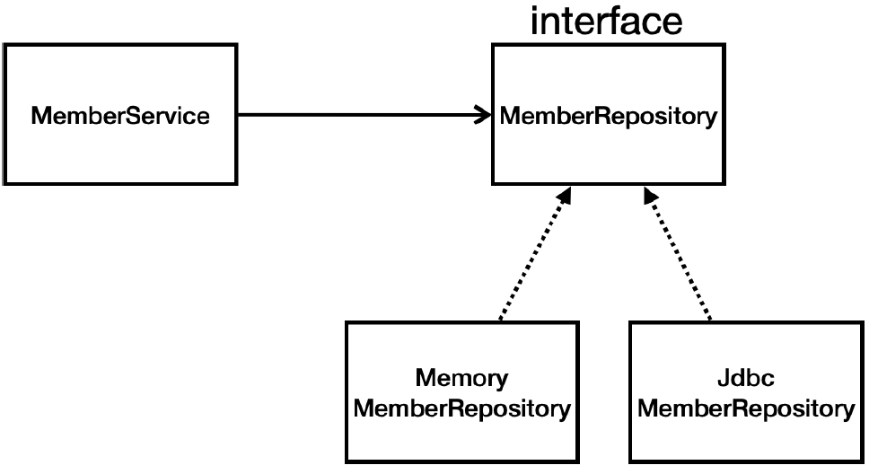
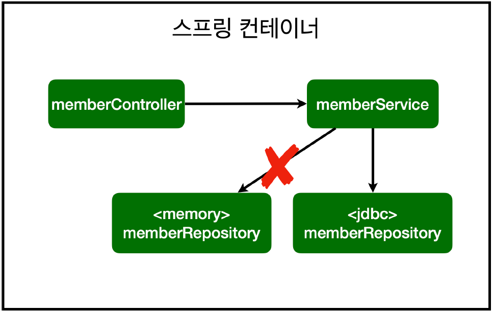
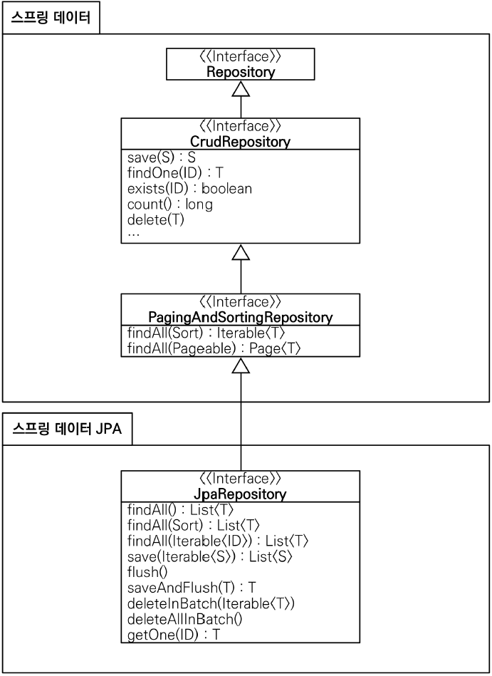

# 스프링 DB 접근 기술
## H2 데이터베이스 설치
개발이나 테스트 용도로 가볍고 편리한 DB, 웹 화면 제공
- [https://www.h2database.com]()
- 권한 주기: `chmod 755 h2.sh` **(윈도우 사용자는 x)**
- 실행: `./h2.sh` **(윈도우 사용자는 h2.bat)**
- 데이터베이스 파일 생성 방법
	- `jdbc:h2:~/test` (최초 한번)
	- `~/test.mv.db` 파일 생성 확인
	- 이후부터는 `jdbc:h2:tcp://localhost/~/test` 이렇게 접속

### 테이블 생성하기
**테이블 관리를 위해 프로젝트 루트에 `sql/ddl.sql` 파일을 생성한다.**
- H2 데이터베이스에 접근해서 `member` 테이블 생성
    ```sql
    drop table if exists member CASCADE;
    create table member
    (
        id bigint generated by default as identity,     -- bigint: java의 long / generated by ... : DB가 자동으로 값을 채워줌
        name varchar(255),
        primary key (id)
    );
    ```

**H2 데이터베이스가 정상 생성되지 않을 때**
1. H2 데이터베이스를 종료하고, 다시 시작한다.
2. 주소창의 앞 부분(예: `100.1.2.3`)만 `localhost` 로 변경하고 Enter를 입력한다. 나머지 부분은 절대 변경하면 안된다. (특히 뒤에 세션 부분이 변경되면 안된다.)
3. 데이터베이스 파일을 생성하면( `jdbc:h2:~/test` ), 데이터베이스가 정상 생성된다.

**DB에 데이터 추가**
```sql
insert into member(name) values('spring')   -- member 모델의 name 필드에 'spring'이라는 데이터 추가하기
``` 

## 순수 Jdbc
### 환경 설정
**build.gradle 파일에 jdbc, h2 데이터베이스 관련 라이브러리 추가**
```
implementation 'org.springframework.boot:spring-boot-starter-jdbc'
runtimeOnly 'com.h2database:h2'
```
**스프링 부트 데이터베이스 연결 설정 추가**
`resources/application.properties`
```
spring.datasource.url=jdbc:h2:tcp://localhost/~/test
spring.datasource.driver-class-name=org.h2.Driver
spring.datasource.username=sa
```
> **주의!**: 스프링부트 2.4부터는 `spring.datasource.username=sa`(공백 주의)를 꼭 추가해주어야 한다. 그렇지 않으면 `Wrong user name or password` 오류가 발생한다. 

### Jdbc 리포지토리 구현
> 주의! 이렇게 JDBC API로 직접 코딩하는 것은 20년 전 이야기이다. 따라서 고대 개발자들이 이렇게 고생하고 살았구나 생각하고, 정신건강을 위해 참고만 하고 넘어가자.

**Jdbc 회원 리포지토리**
> `hello.hellospring.repository.JdbcMemberRepository` 참고

**스프링 설정 변경**
```java
package hello.hello_spring;

import hello.hello_spring.repository.JdbcMemberRepository;
import hello.hello_spring.repository.MemberRepository;
import hello.hello_spring.service.MemberService;
import org.springframework.beans.factory.annotation.Autowired;
import org.springframework.context.annotation.Bean;
import org.springframework.context.annotation.Configuration;

import javax.sql.DataSource;

@Configuration
public class SpringConfig {

    private DataSource dataSource;

    @Autowired
    public SpringConfig(DataSource dataSource) {
        this.dataSource = dataSource;
    }

    @Bean
    public MemberService memberService() {
        return new MemberService(memberRepository());
    }

    @Bean
    public MemberRepository memberRepository() {
        return new JdbcMemberRepository(dataSource);
    }
}

```
- DataSource: 데이터베이스 커넥션을 획득할 때 사용하는 객체
- 스프링 부트는 데이터베이스 커넥션 정보를 바탕으로 DataSource를 생성하고 스프링 빈으로 만들어둔다. 그래서 DI를 받을 수 있다.

**구현 클래스 추가 이미지**



**스프링 설정 이미지**


- 개방-폐쇄 원칙(OCP, Open-Closed Principle)
    - 확장에는 열려있고, 수정, 변경에는 닫혀있다.
- 스프링의 DI (Dependencies Injection)을 사용하면 **기존 코드를 전혀 손대지 않고, 설정만으로 구현 클래스를 변경**할 수 있다.
- 데이터를 DB에 저장하므로 스프링 서버를 다시 실행해도 데이터가 안전하게 저장된다.
  
## 스프링 통합 테스트
**회원 서비스 스프링 통합 테스트**
```java
@SpringBootTest
@Transactional
public class MemberServiceIntegrationTest {

    // 테스트 케이스는 injection 후 따로 사용하지 않기 때문에 간단하게 Autowired 사용 + MemoryMemberRepository -> MemberRepository
    @Autowired MemberService memberService;
    @Autowired MemberRepository memberRepository;
```
- `@SpringBootTest` : 스프링 컨테이너와 테스트를 함께 실행한다.
- `@Transactional` : 테스트 케이스에 이 애노테이션이 있으면, 테스트 시작 전에 트랜잭션을 시작하고, 테스트 완료 후에 항상 롤백한다. 이렇게 하면 DB에 데이터가 남지 않으므로 다음 테스트에 영향을 주지 않는다.


## 스프링 JdbcTemplate

- 순수 Jdbc와 동일한 환경설정을 하면 된다.
- 스프링 JdbcTemplate과 MyBatis 같은 라이브러리는 JDBC API에서 본 반복 코드를 대부분 제거해준다. 하지만 SQL은 직접 작성해야 한다.
  
**스프링 JdbcTemplate 회원 리포지토리**
```java
package hello.hello_spring.repository;

import hello.hello_spring.domain.Member;
import org.springframework.jdbc.core.JdbcTemplate;
import org.springframework.jdbc.core.RowMapper;
import org.springframework.jdbc.core.namedparam.MapSqlParameterSource;
import org.springframework.jdbc.core.simple.SimpleJdbcInsert;

import javax.sql.DataSource;
import java.util.HashMap;
import java.util.List;
import java.util.Map;
import java.util.Optional;

public class JdbcTemplateMemberRepository implements MemberRepository {

    private final JdbcTemplate jdbcTemplate;

    // dataSource 통해 injection 받기
//    @Autowired    생성자 하나이므로 생략가능
    public JdbcTemplateMemberRepository(DataSource dataSource) {
        jdbcTemplate = new JdbcTemplate(dataSource);
    }

    @Override
    public Member save(Member member) {
        SimpleJdbcInsert jdbcInsert = new SimpleJdbcInsert(jdbcTemplate);
        jdbcInsert.withTableName("member").usingGeneratedKeyColumns("id");

        Map<String, Object> parameters = new HashMap<>();
        parameters.put("name", member.getName());

        Number key = jdbcInsert.executeAndReturnKey(new MapSqlParameterSource(parameters));
        member.setId(key.longValue());
        return member;
    }

    @Override
    public Optional<Member> findById(Long id) {
        List<Member> result = jdbcTemplate.query("select * from member where id = ?", memberRowMapper(), id);
        return result.stream().findAny();
    }

    @Override
    public Optional<Member> findByName(String name) {
        List<Member> result = jdbcTemplate.query("select * from member where name = ?", memberRowMapper(), name);
        return result.stream().findAny();
    }

    @Override
    public List<Member> findAll() {
        return jdbcTemplate.query("select * from member", memberRowMapper());
    }

    private RowMapper<Member> memberRowMapper() {
        return (rs, rowNum) -> {
            Member member = new Member();
            member.setId(rs.getLong("id"));
            member.setName(rs.getString("name"));
            return member;
        };
    }
}

```
**JdbcTemplate을 사용하도록 스프링 설정 변경**
```java
package hello.hello_spring;

import hello.hello_spring.repository.JdbcMemberRepository;
import hello.hello_spring.repository.JdbcTemplateMemberRepository;
import hello.hello_spring.repository.MemberRepository;
import hello.hello_spring.repository.MemoryMemberRepository;
import hello.hello_spring.service.MemberService;
import org.springframework.beans.factory.annotation.Autowired;
import org.springframework.context.annotation.Bean;
import org.springframework.context.annotation.Configuration;

import javax.sql.DataSource;

@Configuration
public class SpringConfig {

    private DataSource dataSource;

    @Autowired
    public SpringConfig(DataSource dataSource) {
        this.dataSource = dataSource;
    }

    @Bean
    public MemberService memberService() {
        return new MemberService(memberRepository());
    }

    @Bean
    public MemberRepository memberRepository() {
//        return new MemoryMemberRepository();
//        return new JdbcMemberRepository(dataSource);
        return new JdbcTemplateMemberRepository(dataSource);
    }
}
```

## JPA

- JPA 사용의 이점
  - 기존의 반복 코드는 물론이고, 기본적인 SQL도 JPA가 직접 만들어서 실행해준다.
  - SQL과 데이터 중심의 설계에서 객체 중심의 설계로 패러다임 전환
  - 개발 생산성 대폭 향상
  
**build.gradle 파일에 JPA, h2 데이터베이스 관련 라이브러리 추가**
```
dependencies {
    implementation 'org.springframework.boot:spring-boot-starter-thymeleaf'
    implementation 'org.springframework.boot:spring-boot-starter-web'
    // implementation 'org.springframework.boot:spring-boot-starter-jdbc'
    implementation 'org.springframework.boot:spring-boot-starter-data-jpa'
    runtimeOnly 'com.h2database:h2'
    testImplementation('org.springframework.boot:spring-boot-starter-test') {
    exclude group: 'org.junit.vintage', module: 'junit-vintage-engine'
    }
}
```
- `spring-boot-starter-data-jpa` 는 내부에 jdbc 관련 라이브러리를 포함한다. 따라서 jdbc는 제거해도 된다.
  
**스프링 부트에 JPA 설정 추가**

`resources/application.properties`
```
spring.datasource.url=jdbc:h2:tcp://localhost/~/test
spring.datasource.driver-class-name=org.h2.Driver
spring.datasource.username=sa
spring.jpa.show-sql=true
spring.jpa.hibernate.ddl-auto=none
```
- JPA는 표준 인터페이스이며, 그 구현체로 hibernate 등등 존재
- `show-sql` : JPA가 생성하는 SQL을 출력한다.
- `ddl-auto` : JPA는 테이블을 자동으로 생성하는 기능을 제공하는데 `none` 를 사용하면 해당 기능을 끈다.
- `create` 를 사용하면 엔티티 정보를 바탕으로 테이블도 직접 생성해준다.

**JPA 엔티티 매핑**
```java
package hello.hello_spring.domain;

import jakarta.persistence.Entity;
import jakarta.persistence.GeneratedValue;
import jakarta.persistence.GenerationType;
import jakarta.persistence.Id;

@Entity	// 엔티티 매핑
public class Member {

	@Id @GeneratedValue(strategy = GenerationType.IDENTITY)	// JPA 사용 시 Id(pk) 매핑
	private Long id;

	private String name;
	
	public Long getId() {
		return id;
	}
	
	public void setId(Long id) {
		this.id = id;
	}
	
	public String getName() {
		return name;
	}
	
	public void setName(String name) {
		this.name = name;
	}
}
```
**JPA 회원 리포지토리**
```java
package hello.hello_spring.repository;

import hello.hello_spring.domain.Member;

import jakarta.persistence.EntityManager;
import java.util.List;
import java.util.Optional;

public class JpaMemberRepository implements MemberRepository {

    private final EntityManager em;

    public JpaMemberRepository(EntityManager em) {
        this.em = em;
    }

    @Override
    public Member save(Member member) {
        em.persist(member);
        return member;
    }

    @Override
    public Optional<Member> findById(Long id) {
        Member member = em.find(Member.class, id);
        return Optional.ofNullable(member);
    }

    @Override
    public Optional<Member> findByName(String name) {
        List<Member> result = em.createQuery("select m from Member m where m.name = :name", Member.class)
                .setParameter("name", name)
                .getResultList();

        return result.stream().findAny();

    }

    @Override
    public List<Member> findAll() {
        return em.createQuery("select m from Member m", Member.class)
                .getResultList();
    }
}
```
**서비스 계층에 트랜잭션 추가**
```java
import org.springframework.transaction.annotation.Transactional

@Transactional
public class MemberService {}
```
- `org.springframework.transaction.annotation.Transactional` 를 사용하자.
  - 스프링은 해당 클래스의 메서드를 실행할 때 트랜잭션을 시작하고, 메서드가 정상 종료되면 트랜잭션을 커밋한다. 만약 런타임 예외가 발생하면 롤백한다.
  - **JPA를 통한 모든 데이터 변경은 트랜잭션 안에서 실행해야 한다.**

**JPA를 사용하도록 스프링 설정 변경**
```java
package hello.hello_spring;

import hello.hello_spring.repository.*;
import hello.hello_spring.service.MemberService;
import jakarta.persistence.EntityManager;
import org.springframework.beans.factory.annotation.Autowired;
import org.springframework.context.annotation.Bean;
import org.springframework.context.annotation.Configuration;

import javax.sql.DataSource;

@Configuration
public class SpringConfig {

//    private DataSource dataSource;
//
//    @Autowired
//    public SpringConfig(DataSource dataSource) {
//        this.dataSource = dataSource;
//    }

    private EntityManager em;

    @Autowired
    public SpringConfig(EntityManager em) {
        this.em = em;
    }

    @Bean
    public MemberService memberService() {
        return new MemberService(memberRepository());
    }

    @Bean
    public MemberRepository memberRepository() {
//        return new MemoryMemberRepository();
//        return new JdbcMemberRepository(dataSource);
//        return new JdbcTemplateMemberRepository(dataSource);
        return new JpaMemberRepository(em);
    }
}

```
> 참고: JPA도 스프링 만큼 성숙한 기술이고, 학습해야 할 분량도 방대하다. 다음 강의와 책을 참고하자.
> > 인프런 강의 링크: [인프런 - 자바 ORM 표준 JPA 프로그래밍 - 기본편]()
> 
> > JPA 책 링크: [자바 ORM 표준 JPA 프로그래밍 - YES24]()

## 스프링 데이터 JPA
- 스프링 부트와 JPA만 사용해도 개발 생산성이 정말 많이 증가하고, 개발해야할 코드도 확연히 줄어듭니다. 
- 스프링 데이터 JPA를 사용하면 리포지토리에 구현 클래스 없이 인터페이스 만으로 개발을 완료할 수 있습니다. 
- 그리고 반복 개발해온 기본 CRUD 기능도 스프링 데이터 JPA가 모두 제공합니다.
- 실무에서 관계형 데이터베이스를 사용한다면 스프링 데이터 JPA는 이제 선택이 아니라 필수 입니다.
> 주의: **스프링 데이터 JPA는 JPA를 편리하게 사용하도록 도와주는 기술입니다. 따라서 JPA를 먼저 학습한 후에 스프링 데이터 JPA를 학습해야 합니다.**


**스프링 데이터 JPA 회원 리포지토리**
```java
package hello.hello_spring.repository;

import hello.hello_spring.domain.Member;
import org.springframework.data.jpa.repository.JpaRepository;

import java.util.Optional;

public interface SpringDataJpaMemberRepository extends JpaRepository<Member, Long>, MemberRepository {

    // JpaRepository 상속한 인터페이스만 만들어두면 별도의 구현이 필요 없다!!
    @Override
    Optional<Member> findByName(String name);
}
```
**스프링 데이터 JPA 회원 리포지토리를 사용하도록 스프링 설정 변경**
```java
package hello.hellospring;

import hello.hellospring.repository.*;
import hello.hellospring.service.MemberService;
import org.springframework.context.annotation.Bean;
import org.springframework.context.annotation.Configuration;

@Configuration
public class SpringConfig {

    private final MemberRepository memberRepository;

    public SpringConfig(MemberRepository memberRepository) {
        this.memberRepository = memberRepository;
    }

    @Bean
    public MemberService memberService() {
        return new MemberService(memberRepository);
    }
}
```
- 스프링 데이터 JPA가 `SpringDataJpaMemberRepository` 를 스프링 빈으로 자동 등록해준다.

**스프링 데이터 JPA 제공 클래스**



**스프링 데이터 JPA 제공 기능**
- 인터페이스를 통한 기본적인 CRUD
- `findByName()` , `findByEmail()` 처럼 메서드 이름 만으로 조회 기능 제공
- 페이징 기능 자동 제공

> 참고: 실무에서는 JPA와 스프링 데이터 JPA를 기본으로 사용하고, 복잡한 동적 쿼리는 Querydsl이라는 라이브러리를 사용하면 된다. 
> Querydsl을 사용하면 쿼리도 자바 코드로 안전하게 작성할 수 있고, 동적 쿼리도편리하게 작성할 수 있다. 
> 이 조합으로 해결하기 어려운 쿼리는 JPA가 제공하는 네이티브 쿼리를 사용하거나, 앞서 학습한 스프링 JdbcTemplate를 사용하면 된다.
자세한 내용은 다음 강의를 참고하자: [인프런 - 실전! 스프링 데이터 JPA]()