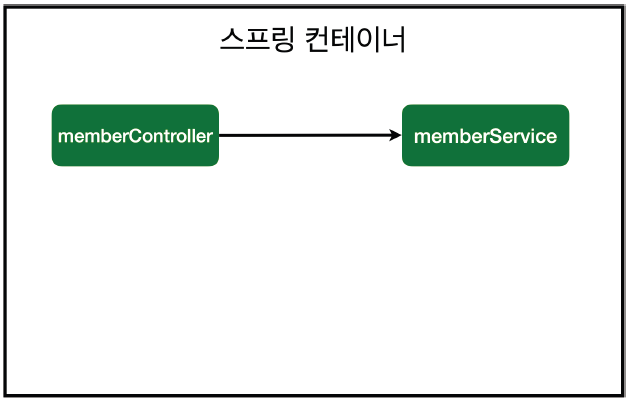
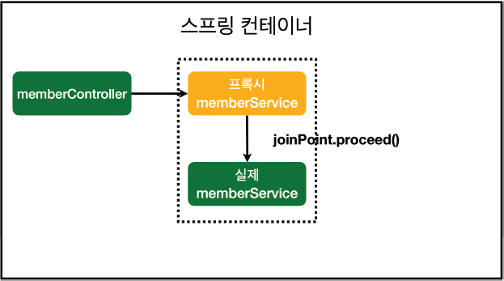
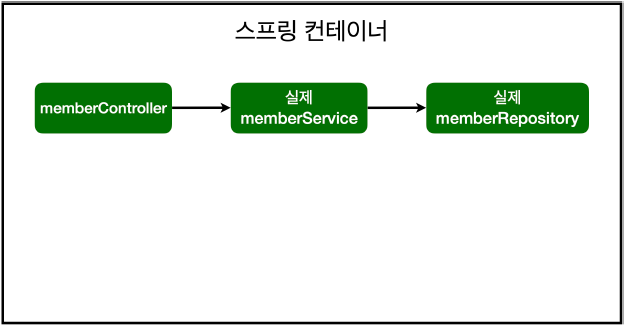
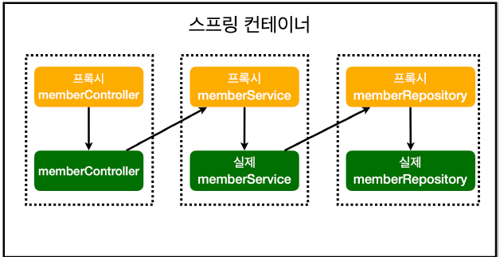

# 7. AOP
## AOP가 필요한 상황
- 모든 메소드의 호출 시간을 측정하고 싶다면?
- 공통 관심 사항(cross-cutting concern) vs 핵심 관심 사항(core concern)
- 회원 가입 시간, 회원 조회 시간을 측정하고 싶다면?

### MemberService 회원 조회 시간 측정 추가
- try-finally 구문과 `System.currentTimeMillis()` 메서드 이용하기?

**문제**
- 회원가입, 회원 조회에 시간을 측정하는 기능은 핵심 관심 사항이 아니다.
- 시간을 측정하는 로직은 공통 관심 사항이다.
- 시간을 측정하는 로직과 핵심 비즈니스의 로직이 섞여서 유지보수가 어렵다.
- 시간을 측정하는 로직을 별도의 공통 로직으로 만들기 매우 어렵다.
- 시간을 측정하는 로직을 변경할 때 모든 로직을 찾아가면서 변경해야 한다.

## AOP 적용
- AOP: Aspect Oriented Programming
- 공통 관심 사항(cross-cutting concern) vs 핵심 관심 사항(core concern) 분리

**시간 측정 AOP 등록**
```java
package hello.hello_spring.aop;

import org.aspectj.lang.ProceedingJoinPoint;
import org.aspectj.lang.annotation.Around;
import org.aspectj.lang.annotation.Aspect;
import org.springframework.stereotype.Component;

@Aspect     // AOP 위한 어노테이션
@Component  // AOP 스프링 빈에 등록
public class TimeTraceAop {

    @Around("execution(* hello.hello_spring..*(..))")   // AOP 적용할 범위
    public Object execute(ProceedingJoinPoint joinPoint) throws Throwable {
        long start = System.currentTimeMillis();
        System.out.println("START: " + joinPoint.toString());   // 시작 시점
        try {
            return joinPoint.proceed();
        } finally {
            long finish = System.currentTimeMillis();
            long timeMs = finish - start;
            System.out.println("END: " + joinPoint.toString() + " " + timeMs + "ms");   // 시간 측정 결과 출력
        }
    }
}
```

**해결**
- 회원가입, 회원 조회등 핵심 관심사항과 시간을 측정하는 공통 관심 사항을 분리한다.
- 시간을 측정하는 로직을 별도의 공통 로직으로 만들었다.
- 핵심 관심 사항을 깔끔하게 유지할 수 있다.
- 변경이 필요하면 이 로직만 변경하면 된다.
- 원하는 적용 대상을 선택할 수 있다.

### 스프링의 AOP 동작 방식 설명
**AOP 적용 전 의존관계**


- memberController가 memberService를 의존하는 단순 관계

**AOP 적용 후 의존관계**


- 프록시(가짜 memberService) 생성
- 스프링 빈에 등록할 때 가짜 memberService를 등록
- joinPoint.proceed() 호출되면 실제 memberService 호출
- 결과적으로 helloController는 프록시를 호출하고, 프록시를 통해 AOP가 실행됨

**AOP 적용 전 전체 그림**



**AOP 적용 후 전체 그림**



- 실제 Proxy가 주입되는지 콘솔에 출력해서 확인하기
  - MemberController 생성자에 출력 메시지 추가
  - `System.out.println("memberService: " + memberService.getClass());`
