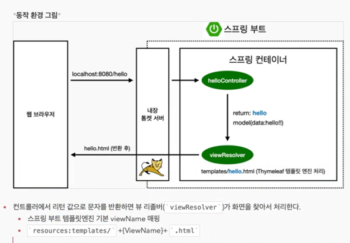
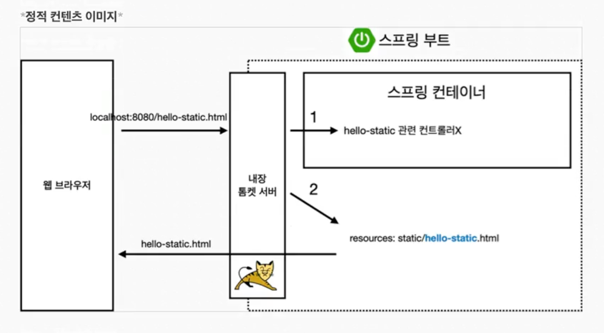
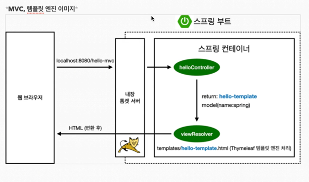
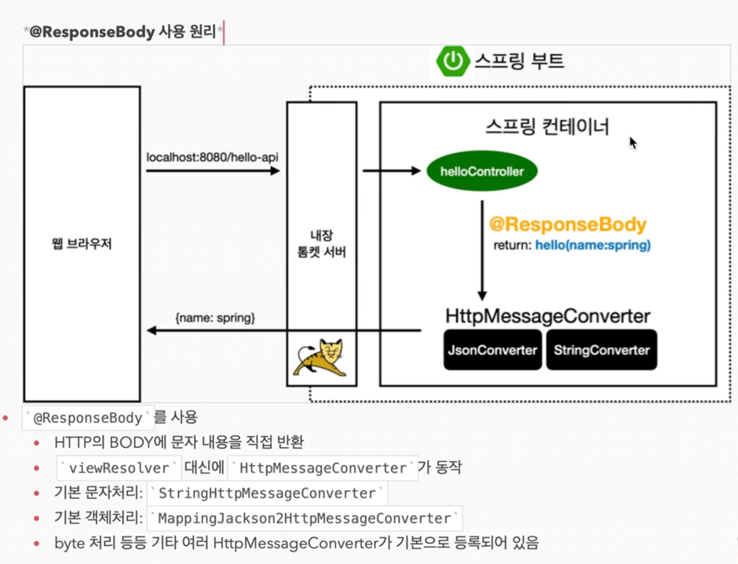

# 프로젝트 환경 설정

## 라이브러리 살펴보기
`Gradle은 의존관계가 있는 라이브러리를 함께 다운로드한다.`

### **스프링부트 라이브러리**
- spring-boot-starter-web
  - spring-boot-start-tomcat: 톰캣(웹서버)
  - spring-webmvc: 스프링 웹 MVC
- spring-boot-starter-thymeleaf: 타임리프 템플릿 엔진(View)
- spring-boot-starter(공통): 스프링 부트 + 스프링 코어 + 로깅
  - spring-boot
    - spring-core
  - spring-boot-starter-logging
    - logback, slf4j

### **테스트 라이브러리**
- spring-boot-starter-test
  - junit: 테스트 프레임워크
  - mockito: 목 라이브러리
  - assertj: 테스트 코드를 좀 더 편하게 작성할 수 있도록 도와주는 라이브러리
  - spring-test: 스프링 통합 테스트 지원

## 클라이언트와 서버 흐름


## 명령어로 빌드하는 법
### 시작
1. `./gradlew build`
2. `cd build/libs`
3. `java -jar hello-spring-0.0.1-SNAPSHOT.jar`
### 빌드 폴더 재시작
1. `./gradlew clean build`

# 스프링 웹 개발 기초
## 정적 콘텐츠
### 코드 예시
```java
    @GetMapping("hello") // django의 url name
    public String hello(Model model) {
        model.addAttribute("data", "hello!!"); // django의 views.py
        return "hello"; // django의 templates
    }

```
### 동작 흐름

1. hello-static 컨트롤러를 찾는다.
2. 1번이 없다면 같은 이름의 .html 파일을 찾는다.
3. 찾은 것을 반환하여 렌더링한다.

## MVC와 템플릿 엔진
### MVC란?
- Model
- View
- Controller
### 코드 예시
```java
    @GetMapping("hello-mvc")
    public String helloMvc(@RequestParam("name") String name, Model model) {
        model.addAttribute("name", name);
        return "hello-template";
    }

    @GetMapping("hello-string")
    @ResponseBody // http body에 아래 데이터를 넣겠다
    public String helloString(@RequestParam("name") String name) {
        return "hello " + name;
    }
```
### 동작 흐름


## API
### 코드 예시
```java
    @GetMapping("hello-api")
    @ResponseBody
    public Hello helloApi(@RequestParam("name") String name) {
        Hello hello = new Hello();
        hello.setName(name);
        return hello;
    }

    static class Hello {
        private String name;

        public String getName() {
            return name;
        }

        public void setName(String name) {
            this.name = name;
        }
    }

```
### 동작 흐름
