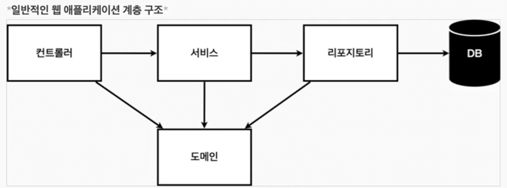

# Spring(2) - 4 ~ 6강

# 비즈니스 요구사항 정리

## 일반적인 웹 어플리케이션 계층 구조



- 컨트롤러: 웹 MVC의 컨트롤러 역할
- 서비스: 핵심 비즈니스 로직 구현
- 리포지토리: 데이터베이스에 접근, 도메인 객체를 DB에 저장하고 관리
- 도메인: 비즈니스 도메인 객체. 예) 회원, 주문, 쿠폰 등등 주로 데이터베이스에 저장하고 관리됨

## 클래스 의존관계 (예시)


- 아직 데이터 저장소가 선정되지 않아서, 우선 인터페이스로 구현 클래스를 변경할 수 있도록 설계
- 데이터 저장소는 RDB, NoSQL 등등 다양한 저장소를 고민 중인 상황으로 가정
- 개발을 진행하기 위해서 초기 개발 단계에서는 구현체로 가벼운 메모리 기반의 데이터 저장소 사용

## 회원 리포지토리 테스트 케이스 작성 (예시)

### 어떻게?

- 자바의 main()이나 웹 애플리케이션의 컨트롤러를 통해 해당 기능을 실행한다.
- 그러나 이 방법은 여러가지 문제를 안고 있어, JUnit이라는 프레임워크로 테스트를 하는 것이 좋다.

### 특징

- 모든 테스트는 순서가 보장되지 않는다
- 순서에 의존하지 않게 메서드를 작성해야 한다.
- 해결 코드 예시
    
    ```java
        @AfterEach // 메서드 테스트 하나가 끝날 때마다 실행해야 하는 어노테이션
        public void afterEach() {
            repository.clearStore();
        }
    ```
    

# 스프링 빈과 의존관계

## 스프링 빈을 등록하고, 의존관계 설정하기

### 스프링 빈을 등록하는 2가지 방법

- 컴포넌트 스캔과 자동 의존관계 설정
    - @Controller, @Repository, …
- 자바 코드로 직접 스프링 빈 등록하기
    - 의존관계를 하나의 파일로 관리할 수 있어서 이것을 더 권장한다.
        
        ```java
        package hello.hello_spring;
        
        import hello.hello_spring.repository.MemberRepository;
        import hello.hello_spring.repository.MemoryMemberRepository;
        import hello.hello_spring.service.MemberService;
        import org.springframework.context.annotation.Bean;
        import org.springframework.context.annotation.Configuration;
        
        @Configuration
        public class SpringConfig {
        
            @Bean
            public MemberService memberService() {
                return new MemberService(memberRepository());
            }
        
            @Bean
            public MemberRepository memberRepository() {
                return new MemoryMemberRepository();
            }
        }
        
        ```
        

# 회원 관리 예제 - 웹 MVC 개발

### 구현

- 학습 자료 참고

### 배운 것

- django의 MTV와 비교하면서 이해하는 것이 좋겠다.
- `django Model ↔ spring Domain`
    - 둘다 데이터베이스 테이블을 정의한다.
    - django와 동일하게 spring도 JPA라는 ORM으로 db와 상호작용한다.
- `django Template ↔ spring ???`
    - 따로 없는 듯 . . . MVC 패턴 내에서는 존재하지 않는다.
    - 강의에서는 html 파일을 생성해서 Thymeleaf로 렌더링 한다.
- `django View ↔ spring Controller, Service`
    - Controller는 django의 urls.py의 path(), views.py의 비즈니스 로직 외 부분(render(), redirect(), context, …)을 담당하는 듯하다.
    - Service는 보다 제대로 된 비즈니스 로직을 따로 빼둔 개념인 듯하다.
        - 복잡하다 싶으면 Service에서 정의한다.
- `django View ↔ spring Repository`
    - Repository에는 데이터베이스 상호작용하는 로직을 모아두었다.
    - django는 View에서 데이터베이스 로직까지 처리하는 것과는 다르다.
- 요약하자면 django는 view에서 모든 비즈니스 로직을 처리하는 반면, spring에서는 Controller → Service → Repository로 역할이 나뉘어 있다.